# Mini-Contract 前端业务架构文档

## 目录
1. [整体架构](#整体架构)
2. [业务流程](#业务流程)
3. [数据流向](#数据流向)
4. [模块详解](#模块详解)
5. [开发规范](#开发规范)

---

## 整体架构

### 分层架构图（Mermaid）

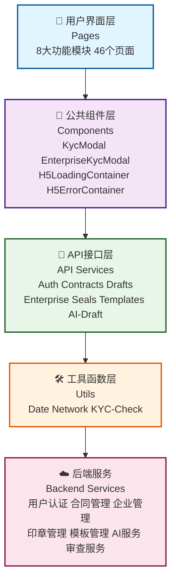

### 模块依赖关系（Mermaid）

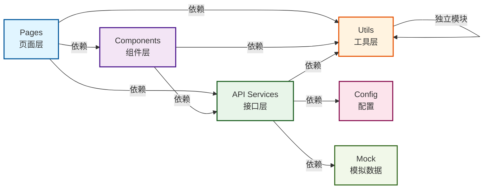

### 架构特点

- **分层清晰**：从页面层到后端服务，层次分明
- **解耦合理**：各层之间通过接口通信，降低耦合度
- **可维护性强**：新功能可快速集成，修改影响范围小
- **可扩展性好**：新模块可独立开发，不影响现有功能

---

## 业务流程

### 1. 用户认证流程（Mermaid）

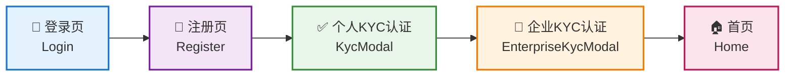

**关键点：**
- 使用 `KycModal` 组件处理个人认证
- 使用 `EnterpriseKycModal` 组件处理企业认证
- 认证状态通过 API 验证

---

### 2. 合同创建流程（Mermaid）

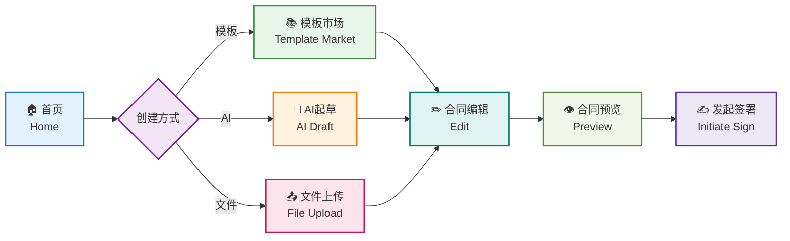

**关键点：**
- 支持三种创建方式：模板、AI起草、文件上传
- 编辑完成后需要预览确认
- 预览后可发起签署流程

---

### 3. 合同签署流程（Mermaid）

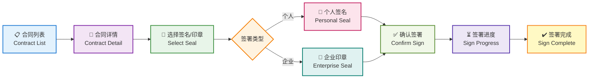

**关键点：**
- 支持个人签名和企业印章
- 实时显示签署进度
- 签署完成后可下载合同

---

### 4. 天眼审查流程（Mermaid）

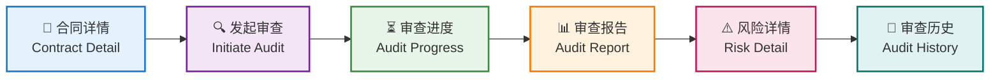

**关键点：**
- 基于AI的合同审查服务
- 生成详细的风险分析报告
- 支持查看历史审查记录

---

### 5. AI起草流程（Mermaid）

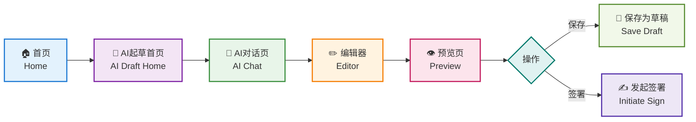

**关键点：**
- 对话式的合同起草体验
- 支持编辑AI生成的内容
- 可保存为草稿或直接发起签署

---

### 6. 企业管理流程（Mermaid）

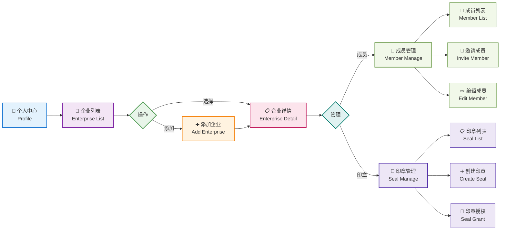

**关键点：**
- 支持多企业账户管理
- 成员管理支持邀请和编辑
- 企业印章支持授权控制

---

### 7. 模板市场流程（Mermaid）

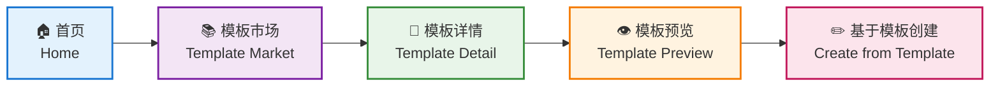

**关键点：**
- 浏览丰富的合同模板库
- 预览模板内容
- 快速基于模板创建合同

---

## 数据流向

### 请求流向（Mermaid）

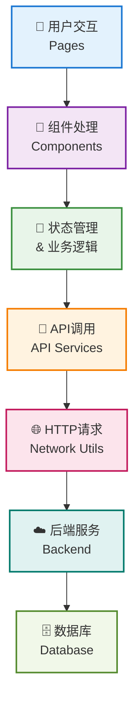

### 响应流向（Mermaid）

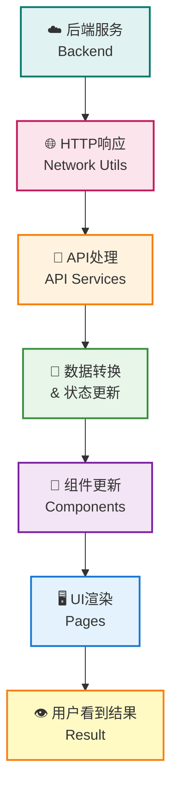

### 数据流示例：创建合同（Mermaid）

```mermaid
graph LR
    A["👤 用户点击<br/>创建合同"] --> B["📄 Pages<br/>contract-create"]
    B --> C["🔌 API调用<br/>contracts.create"]
    C --> D["🌐 HTTP POST<br/>Network Utils"]
    D --> E["☁️ 后端处理<br/>& 保存数据库"]
    E --> F["✅ HTTP 200<br/>+ 合同ID"]
    F --> G["🔌 API处理<br/>返回合同对象"]
    G --> H["💾 页面更新<br/>状态"]
    H --> I["✨ 显示成功<br/>提示"]
    I --> J["🔗 跳转到<br/>合同详情"]
    
    style A fill:#e3f2fd,stroke:#1976d2,stroke-width:2px
    style B fill:#f3e5f5,stroke:#7b1fa2,stroke-width:2px
    style C fill:#e8f5e9,stroke:#388e3c,stroke-width:2px
    style D fill:#fff3e0,stroke:#f57c00,stroke-width:2px
    style E fill:#fce4ec,stroke:#c2185b,stroke-width:2px
    style F fill:#e0f2f1,stroke:#00796b,stroke-width:2px
    style G fill:#f1f8e9,stroke:#558b2f,stroke-width:2px
    style H fill:#ede7f6,stroke:#512da8,stroke-width:2px
    style I fill:#fff9c4,stroke:#f57f17,stroke-width:2px
    style J fill:#e1bee7,stroke:#6a1b9a,stroke-width:2px
```

---

## 模块详解

### 1. Pages 层（用户界面层）

**职责：**
- 展示用户界面
- 处理用户交互
- 调用 API 和组件
- 管理页面状态

**包含模块：**
- `login/` - 登录注册
- `contract-manage/` - 合同管理
- `contract-create/` - 合同创建
- `contract-sign/` - 合同签署
- `contract-audit/` - 天眼审查
- `ai-draft/` - AI起草
- `template-market/` - 模板市场
- `enterprise/` - 企业管理
- `profile/` - 个人中心

**开发规范：**
```typescript
// 页面结构示例
<template>
  <view class="page">
    <!-- 使用公共组件 -->
    <KycModal ref="kycModal" />
    
    <!-- 页面内容 -->
    <view class="content">
      <!-- ... -->
    </view>
  </view>
</template>

<script lang="uts">
import { contracts } from '../../api/contracts/index';

export default {
  data() {
    return {
      contractList: [],
      loading: false
    }
  },
  
  methods: {
    async loadContracts() {
      this.loading = true;
      try {
        const res = await contracts.page({ page: 1, limit: 10 });
        this.contractList = res.data;
      } catch (err) {
        console.error('加载失败', err);
      } finally {
        this.loading = false;
      }
    }
  },
  
  onLoad() {
    this.loadContracts();
  }
}
</script>
```

---

### 2. Components 层（公共组件层）

**职责：**
- 提供可复用的 UI 组件
- 封装通用业务逻辑
- 处理组件间通信

**包含组件：**
- `KycModal.uvue` - 个人KYC认证弹窗
- `EnterpriseKycModal.uvue` - 企业KYC认证弹窗
- `H5LoadingContainer.uvue` - H5加载容器
- `H5ErrorContainer.uvue` - H5错误容器

**开发规范：**
```typescript
// 组件结构示例
<template>
  <view class="modal" v-if="visible">
    <view class="modal-content">
      <!-- 组件内容 -->
    </view>
  </view>
</template>

<script lang="uts">
export default {
  props: {
    visible: {
      type: Boolean,
      default: false
    }
  },
  
  emits: ['close', 'success'],
  
  methods: {
    handleClose() {
      this.$emit('close');
    },
    
    handleSuccess(data: any) {
      this.$emit('success', data);
    }
  }
}
</script>
```

---

### 3. API Services 层（接口服务层）

**职责：**
- 封装后端 API 调用
- 处理请求/响应
- 错误处理和重试

**包含模块：**
- `auth/` - 认证接口
- `contracts/` - 合同接口
- `drafts/` - 草稿接口
- `enterprise/` - 企业接口
- `seals/` - 印章接口
- `templates/` - 模板接口
- `ai-draft/` - AI起草接口

**开发规范：**
```typescript
// API 模块结构示例
import { request } from '../utils/network';

export const contracts = {
  // 获取合同列表
  page(params: any) {
    return request({
      url: '/contracts/page',
      method: 'GET',
      data: params
    });
  },
  
  // 创建合同
  create(data: any) {
    return request({
      url: '/contracts/create',
      method: 'POST',
      data
    });
  },
  
  // 获取合同详情
  get(id: string) {
    return request({
      url: `/contracts/${id}`,
      method: 'GET'
    });
  },
  
  // 更新合同
  update(id: string, data: any) {
    return request({
      url: `/contracts/${id}`,
      method: 'PUT',
      data
    });
  },
  
  // 删除合同
  delete(id: string) {
    return request({
      url: `/contracts/${id}`,
      method: 'DELETE'
    });
  }
};
```

---

### 4. Utils 层（工具函数层）

**职责：**
- 提供通用工具函数
- 处理日期、网络等通用操作
- 不依赖其他前端模块

**包含模块：**
- `date.uts` - 日期处理工具
- `network.uts` - 网络请求工具
- `kyc-check.uts` - KYC检查工具

**开发规范：**
```typescript
// 工具函数示例
export function formatDate(date: Date, format: string = 'YYYY-MM-DD'): string {
  // 实现日期格式化
}

export function request(config: any): Promise<any> {
  // 实现网络请求
}

export function checkKycStatus(): boolean {
  // 检查KYC状态
}
```

---

## 开发规范

### 1. 文件命名规范

- **页面文件**：使用 kebab-case，如 `contract-detail.uvue`
- **组件文件**：使用 PascalCase，如 `KycModal.uvue`
- **API 模块**：使用 kebab-case，如 `ai-draft/index.uts`
- **工具文件**：使用 kebab-case，如 `kyc-check.uts`

### 2. 导入规范

```typescript
// 页面中导入 API
import { contracts } from '../../api/contracts/index';

// 页面中导入组件
import KycModal from '../../components/KycModal.uvue';

// 页面中导入工具
import { formatDate } from '../../utils/date';
```

### 3. API 调用规范

```typescript
// 正确的做法
async loadData() {
  try {
    const res = await contracts.page({ page: 1 });
    this.data = res.data;
  } catch (err) {
    console.error('加载失败', err);
    // 显示错误提示
  }
}

// 错误的做法 - 不要直接调用 uni.request
uni.request({
  url: 'http://...',
  success: (res) => { }
});
```

### 4. 组件通信规范

```typescript
// 父组件
<template>
  <KycModal 
    ref="kycModal"
    @close="handleClose"
    @success="handleSuccess"
  />
</template>

// 子组件
<script>
export default {
  emits: ['close', 'success'],
  methods: {
    handleSubmit() {
      this.$emit('success', data);
    }
  }
}
</script>
```

### 5. 错误处理规范

```typescript
// 统一的错误处理
async loadData() {
  try {
    const res = await api.getData();
    if (res.code !== 0) {
      throw new Error(res.message);
    }
    this.data = res.data;
  } catch (err) {
    uni.showToast({
      title: '加载失败',
      icon: 'error'
    });
    console.error('Error:', err);
  }
}
```

---

## 总结

Mini-Contract 前端采用**分层架构**设计，从上到下分为：

1. **Pages** - 用户界面层
2. **Components** - 公共组件层
3. **API Services** - 接口服务层
4. **Utils** - 工具函数层
5. **Backend** - 后端服务

这样的架构设计具有以下优势：

- ✅ **清晰的职责划分** - 每层有明确的职责
- ✅ **高度的解耦** - 各层通过接口通信
- ✅ **易于维护** - 修改影响范围小
- ✅ **便于扩展** - 新功能可快速集成
- ✅ **便于测试** - 各层可独立测试

遵循这些架构规范和开发规范，可以确保代码质量和项目的长期可维护性。
