  Mini Contract Pro (Free Open Source Electronic Contract)
  ===============


Current Latest Version: v3.0.0 (Release Date: November 22, 2025)

[](https://gitee.com/leepm/mini-contract/blob/master/LICENSE)[](https://gitee.com/leepm/mini-contract)[](https://gitee.com/leepm/mini-contract)[](https://gitee.com/leepm/mini-contract)[](https://gitee.com/leepm/mini-contract)


<h3 align="center">Mini Contract Pro</h3>


🚀🚀🚀  As a free open-source product with independent intellectual property rights, Mini Contract Pro has always adhered to the principle of "making digital contract development simpler". Mini-Contract-Pro is also an open-source electronic signature solution designed specifically for developers, innovatively adopting a "dual-mode engine" architecture. Through modular design, it meets the full-scenario requirements from judicial-level signing to lightweight collaboration. The first open-source electronic signature platform to support both evidence chain and non-evidence chain dual modes, we have helped 100+ enterprise customers achieve digital transformation of contract signing processes.


####  Dual-Mode Engine (Flexibly Address Business Scenarios)

**Judicial-Level Evidence Chain Mode**

Based on the Ant Judicial Chain blockchain evidence storage system, it generates an evidence storage report including timestamps and digital fingerprints for each contract, ensuring contracts comply with the requirements of the "Electronic Signature Law". This mode has been certified by the National Industrial Information Security Development Research Center and is particularly suitable for high-value scenarios such as financial lending, human resources contracts, and intellectual property agreements, with evidence query response speeds reaching millisecond level.


**Lightweight Non-Evidence Chain Mode**

Adopting self-developed distributed storage technology, it reduces interface call costs by 60% through intelligent routing algorithms. Developers can implement full lifecycle contract management without connecting to third-party evidence storage institutions. It is particularly suitable for high-frequency scenarios such as internal approvals, supplier reconciliations, and quick signing, with a capacity to handle tens of millions of signing requests per day.


#### Developer-Friendly

**Plug-and-Play Toolkit**

* Electronic signature/seal cloud hosting service

* Multi-party contract collaborative editing (supports 50+ signing parties operating in parallel)

* Intelligent riding seal generation engine (pixel-level positioning accuracy)

* Full-channel signing pages (Web/H5/Mini Program/APP multi-platform adaptive)


**Deep Open Capabilities**

* Provides SDKs in multiple languages including Java/Python/Go

* Opens rich API interfaces


### Why Choose Mini Contract Pro?

**All-in-One Integration Solution**
We integrate mainstream electronic contract service providers in the market (including but not limited to Fadada, e-SignBao, Junziqian, etc.), providing standardized API integration solutions. Developers don't need to integrate with different vendors individually; they can quickly access multiple services through a unified interface, saving more than 90% of integration time. The pre-configured vendor qualification certification system can help you quickly pass compliance audits.


**Cost Optimization Advantage**
Through the scale effect of centralized procurement, we provide developers with more favorable interface prices than official channels (average discount of 15%-30%). Supports vendor combination selection on demand, avoiding single vendor lock-in risks, truly achieving controllable costs.


**Enterprise-Level Technical Architecture**
Built on Vue3 + TypeScript + Pinia, adopting:

- Modular design: Supports on-demand loading of service provider functions
- Responsive layout: Perfectly adapts to PC/mobile dual platforms
- Configuration-based development: 90% of common requirements can be implemented through configuration
- Complete type support: Comprehensive TS type definitions and interface documentation


**Rapid Implementation Capability (Providing Out-of-the-Box Solution)**

- Standardized UI component library: Contains 30+ business-validated contract template components (MIT license for commercial use)
- Full-link monitoring: Full-process tracking and evidence storage from contract creation to archiving


### Commercial Licensing

1. The commercial version is identical to the open-source version in code, with no distinction;
2. Commercial licensing is perpetual, supporting permanent upgrades;
3. Commercial use requires authorization, and you can contact the technical team below for the authorization method.


### Open Source Notice

1. Only allowed for personal learning and research use;
2. Prohibited from selling this open-source code and resources in any form or name.


### Business Scenarios

* **Human Resources Companies:** Frequently signing contracts, high cost of paper contracts, batch contract signing business scenarios
* **Financial Companies:** Complete contract signing online, retain timely and effective contract management

* **Market Sales Companies:** When selling products through online sales, need to quickly reach cooperation and immediately sign contracts

* **Rental Companies:** Need to quickly sign contracts for offline rental companies, online contract management, inquiry, and automatic contract expiration reminders


Directory Structure
-----------------------------------

```json
mini-contract-pro/
├── App.uvue                        // Application configuration, global styles, and lifecycle management
├── main.uts                        // Application entry file
├── index.html                      // H5 development template
├── manifest.json                   // Application packaging configuration (app name, appid, version, etc.)
├── pages.json                      // Page routing configuration, navigation bar, tabs, etc.
├── package.json                    // Project dependency management
├── uni.scss                        // SCSS global variable preset, unified application style
├── vue.config.js                   // Development configuration
├── README.md                       // Project documentation
│
├── api/                            // Interface management layer, classified by function
│   ├── index.uts                   // API main entry, exporting all interfaces
│   ├── auth.uts                    // Authentication-related interfaces
│   ├── config.uts                  // Configuration management
│   ├── auth/
│   │   └── login.uts               // Login interface
│   ├── ai-draft/
│   │   └── index.uts               // AI drafting-related interfaces
│   ├── contracts/
│   │   └── index.uts               // Contract management interface
│   ├── drafts/
│   │   └── index.uts               // Draft management interface
│   ├── enterprise/
│   │   └── index.uts               // Enterprise management interface
│   ├── seals/
│   │   └── index.uts               // Seal management interface
│   ├── templates/
│   │   └── index.uts               // Template management interface
│   ├── mock/                       // Mock data
│   │   ├── index.uts
│   │   └── templates.uts
│   └── utils/
│       └── download.uts            // Download utility functions
│
├── components/                     // Public component library
│   ├── README.md                   // Component usage documentation
│   ├── KycModal.uvue               // KYC authentication modal component
│   ├── EnterpriseKycModal.uvue     // Enterprise KYC authentication modal
│   ├── H5LoadingContainer.uvue     // H5 loading container
│   ├── H5ErrorContainer.uvue       // H5 error container
│   ├── KYC_GUARD_USAGE.md          // KYC guard usage guide
│   ├── ENTERPRISE_KYC_MODAL_USAGE.md
│   └── H5_SERVICE_CHECK_GUIDE.md
│
├── pages/                          // Page files (organized by functional modules)
│   ├── login/
│   │   └── index.uvue              // Login page
│   ├── register/
│   │   └── index.uvue              // Register page
│   ├── index/
│   │   └── index.uvue              // Home page
│   ├── contract-manage/            // Contract management module
│   │   ├── index.uvue              // Contract list
│   │   └── draft.uvue              // Draft box
│   ├── contract-create/            // Contract creation module
│   │   ├── setup.uvue              // Creation setup
│   │   ├── file.uvue               // File upload
│   │   ├── image.uvue              // Image upload
│   │   └── h5-create.uvue          // H5 creation page
│   ├── contract-detail/            // Contract details
│   │   └── index.uvue
│   ├── contract-form/              // Contract form filling
│   │   └── h5-fill.uvue
│   ├── contract-sign/              // Contract signing module
│   │   ├── index.uvue              // Signing page
│   │   └── h5-sign.uvue            // H5 signing page
│   ├── contract-view/              // Contract viewing
│   │   └── h5-view.uvue
│   ├── contract-review/            // Contract review
│   │   └── index.uvue
│   ├── contract-audit/             // Contract audit (Tianyan audit)
│   │   ├── intro.uvue              // Audit introduction
│   │   ├── progress.uvue           // Audit progress
│   │   ├── report.uvue             // Audit report
│   │   ├── risk-detail.uvue        // Risk details
│   │   └── history.uvue            // Audit history
│   ├── ai-draft/                   // AI drafting module
│   │   ├── index.uvue              // AI drafting home
│   │   ├── chat.uvue               // AI conversation page
│   │   ├── editor.uvue             // Editor page
│   │   ├── detail.uvue             // Details page
│   │   ├── preview.uvue            // Preview page
│   │   └── history.uvue            // History
│   ├── template-market/            // Template market
│   │   └── index.uvue
│   ├── template-detail/            // Template details
│   │   └── index.uvue
│   ├── template-preview/           // Template preview
│   │   └── index.uvue
│   ├── enterprise/                 // Enterprise management module
│   │   ├── list.uvue               // Enterprise list
│   │   ├── add.uvue                // Add enterprise
│   │   ├── detail.uvue             // Enterprise details
│   │   ├── members.uvue            // Member management
│   │   ├── member-invite.uvue      // Invite members
│   │   ├── member-edit.uvue        // Edit member
│   │   ├── seals.uvue              // Enterprise seal management
│   │   ├── seal-create.uvue        // Create enterprise seal
│   │   └── seal-authorize.uvue     // Seal authorization
│   ├── profile/                    // Personal center module
│   │   ├── index.uvue              // Personal center home
│   │   ├── personal-info.uvue      // Personal information
│   │   ├── seals.uvue              // Personal seal management
│   │   ├── seal-create.uvue        // Create personal seal
│   │   ├── settings.uvue           // Settings
│   │   ├── notifications.uvue      // Notifications
│   │   ├── packages.uvue           // Package management
│   │   ├── help.uvue               // Help center
│   │   └── about.uvue              // About application
│   ├── kyc/                        // KYC authentication module
│   │   └── index.uvue
│   ├── agreement/                  // Agreement pages
│   │   ├── user.uvue               // User agreement
│   │   └── privacy.uvue            // Privacy policy
│   └── pdf-preview/                // PDF preview

├── utils/                          // Utility function library
│   ├── date.uts                    // Date processing utilities
│   ├── network.uts                 // Network request utilities
│   └── kyc-check.uts               // KYC check utilities

├── static/                         // Static resources
│   └── [Images, fonts and other resource files]

├── scripts/                        // Build scripts
│   └── [Build-related scripts]

└── uni_modules/                    // uni-app plugin modules
```


Technical Architecture
-----------------------------------

#### Development Environment

- **Application Name**: JieYiQian (捷易签)

- **Framework**: uni-app + Vue 3
- **Language**: UTS (TypeScript)
- **Version**: 3.0.0
- **Supported Platforms**: iOS, Android, H5, Mini Programs, APP
- **IDE (Frontend)**: HBuilder


## Core Functional Modules

### 1. User System
- **Login/Register**: User account management
- **Real-name Authentication**: Personal KYC authentication
- **Enterprise Authentication**: Enterprise-level KYC authentication

### 2. Contract Management
- **Create Contract**: Supports file upload, image upload, template creation
- **Contract List**: View all contracts, supports filtering and searching
- **Draft Management**: Save unfinished contract drafts
- **Contract Details**: View complete contract information
- **Contract Review**: Review contract content

### 3. Contract Signing
- **Signing Process**: Supports multi-party signing
- **Signature Management**: Create and manage personal signatures
- **Seal Management**: Create and manage personal/enterprise seals
- **Signing Progress**: Real-time view of signing status

### 4. Tianyan Audit (AI Audit)
- **Audit Introduction**: Display audit function description
- **Audit Progress**: Real-time display of audit progress
- **Audit Report**: Generate detailed risk analysis report
- **Risk Details**: View specific risk items
- **Audit History**: View historical audit records

### 5. AI Drafting
- **AI Conversation**: Conversational contract drafting with AI
- **Editor**: Edit AI-generated contracts
- **Preview**: Preview contract content
- **History**: View historical drafting records

### 6. Template System
- **Template Market**: Browse available contract templates
- **Template Details**: View template detailed information
- **Template Preview**: Preview template content
- **Template Usage**: Create contracts based on templates

### 7. Enterprise Management
- **Enterprise List**: Manage multiple enterprise accounts
- **Enterprise Details**: View enterprise information
- **Member Management**: Add, edit, delete enterprise members
- **Member Invitation**: Invite new members to join enterprise
- **Enterprise Seals**: Create and manage enterprise-level seals
- **Seal Authorization**: Control member permissions for seal usage

### 8. Personal Center
- **Personal Information**: Manage user basic information
- **Personal Seals**: Create and manage personal seals
- **Settings**: Application settings and preferences
- **Notifications**: Message and notification management
- **Package Management**: View and upgrade user packages
- **Help Center**: FAQs and help documentation
- **About Application**: Application information and version

## Technology Stack

### Frontend Framework
- **uni-app**: Cross-platform development framework, supports iOS, Android, H5, Mini Programs
- **Vue 3**: Progressive JavaScript framework
- **UTS**: TypeScript variant for uni-app development

### Development Tools
- **@dcloudio/uni-ui**: uni-app official UI component library
- **@dcloudio/uniapp-cli**: uni-app CLI tool

### Style System
- **SCSS**: CSS preprocessor, global variable management through uni.scss
- **CSS Mask + SVG**: Modern minimalist icon system

## API Interface Management

All API interfaces are uniformly managed in the `api/` directory and classified by functional modules:

- **Authentication Interface**: `api/auth.uts`, `api/auth/login.uts`
- **Contract Interface**: `api/contracts/index.uts`
- **Draft Interface**: `api/drafts/index.uts`
- **Enterprise Interface**: `api/enterprise/index.uts`
- **Seal Interface**: `api/seals/index.uts`
- **Template Interface**: `api/templates/index.uts`
- **AI Drafting Interface**: `api/ai-draft/index.uts`

### Seal Management API Example

```typescript
// Get seal list
getSealList(params: { identityType: number; enterpriseId?: number; })

// Personal seal operations
userSeal.create(data)
userSeal.update(data)
userSeal.delete(id)
userSeal.page(params)

// Enterprise seal operations
enterpriseSeal.create(data)
enterpriseSeal.update(data)
enterpriseSeal.delete(id)
enterpriseSeal.page(params)

// Enterprise seal authorization
enterpriseSeal.grantCreate(data)
enterpriseSeal.grantDelete(id)
enterpriseSeal.grantList(sealId)
```

## Development Guide

### Environment Setup

```bash
# Install dependencies
npm install

# Development mode
npm run dev

# Build production version
npm run build
```

### Page Development

1. Create new page files (.uvue format) in the `pages/` directory
2. Configure page routes in `pages.json`
3. Use `uni.navigateTo()` for page navigation

### Component Development

1. Create new components (.uvue format) in the `components/` directory
2. Import components in required pages
3. Refer to `components/README.md` to understand existing components

### API Calls

```typescript
// Import API
import { userSeal } from '../../api/seals/index';

// Call API
userSeal.create(sealData)
  .then(res => {
    console.log('Success', res);
  })
  .catch(err => {
    console.error('Failed', err);
  });
```

## Important Documentation

- **Component Documentation**: `components/README.md`
- **KYC Usage Guide**: `components/KYC_GUARD_USAGE.md`
- **Enterprise KYC Documentation**: `components/ENTERPRISE_KYC_MODAL_USAGE.md`
- **H5 Service Check**: `components/H5_SERVICE_CHECK_GUIDE.md`
- **Authentication API Documentation**: `API_DOCS_APP_AUTH.md`

## FAQs

### How to add a new page?
1. Create a new folder and .uvue file in the `pages/` directory
2. Add page configuration in `pages.json`
3. Navigate to the new page using `uni.navigateTo()`

### How to call backend API?
All API calls are made through interface functions in the `api/` directory to ensure unified request management and error handling.

### How to use KYC authentication?
Refer to `components/KYC_GUARD_USAGE.md` and `components/ENTERPRISE_KYC_MODAL_USAGE.md` documentation.

### How to handle H5 compatibility issues?
Wrap H5 pages with `H5LoadingContainer` and `H5ErrorContainer` components, refer to `components/H5_SERVICE_CHECK_GUIDE.md`.


Project Screenshots
----


> Currently supports login via mobile phone number and account in 2 ways;
>
> Currently we support multiple ways to initiate contracts including templates, files, images, etc.;
>
> We also support AI contract drafting;
>
> Tianyan audit is mainly for contract risk review;


> Template center supports pre-setting rich contract templates for users or enterprise employees to select contract templates to quickly create contracts;
>
> Users can clearly understand the data and fields to be filled in the current contract template in the template details, so that they can easily know whether this template matches their needs;


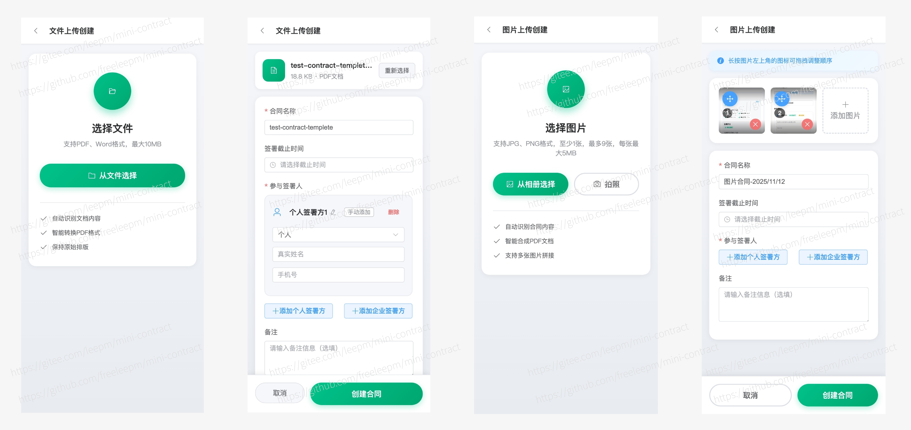

> File upload to create a contract, you can set the corresponding signers, the number of signers here is completely set by the contract initiator;
>
> Support multiple images uploaded and merged into PDF and then create contracts, also can set the corresponding signers, the number of signers here is completely set by the contract initiator;


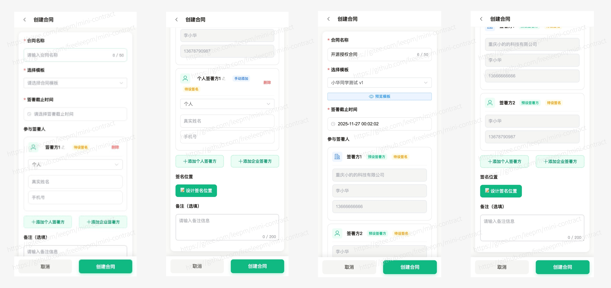

> After completing the basic information for creating a contract, you can initiate the contract creation;


> Contract management supports tab filtering of contracts with different statuses, and you can also view corresponding contract details by clicking on the contract


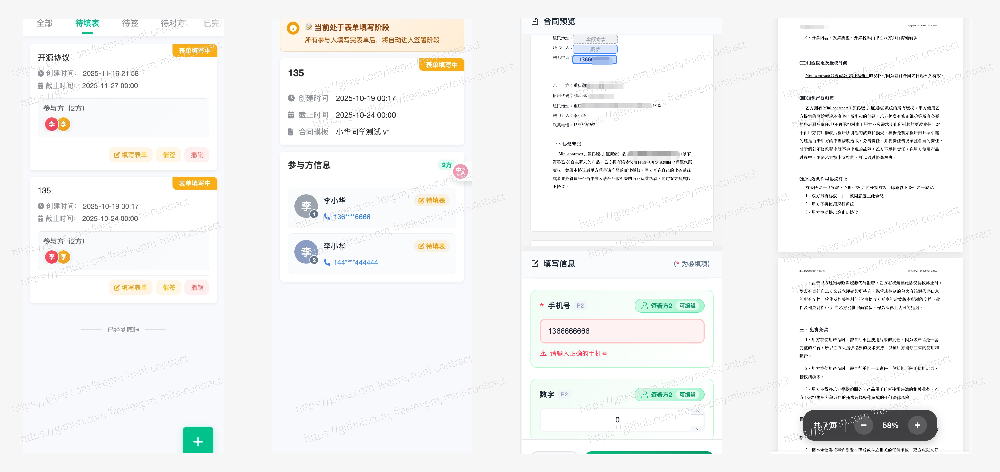

> If the contract template requires filling in form information before signing, users need to fill in the form first before they can sign the contract;


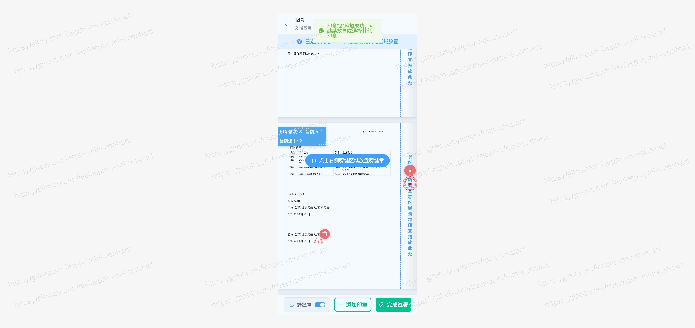

> During signing, it supports setting riding seals, free seals, and personal signatures;


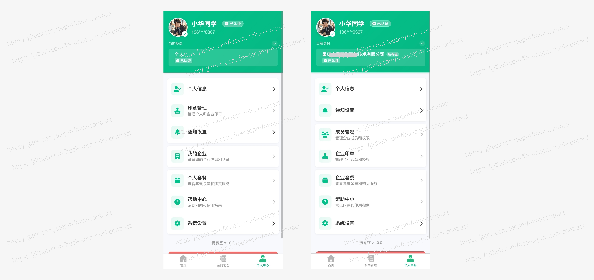

> User's personal center, supports switching the current enterprise


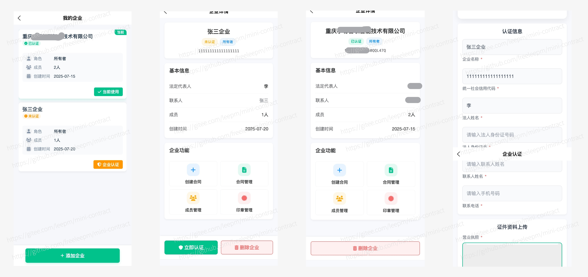

> Users can freely add real-name enterprises, and the first user who creates an enterprise is the super administrator of that enterprise;
>
> After entering a certain enterprise, it supports enterprise-specific operations such as "contract creation", "contract management", "member management", "seal management", etc.;
>
> At the same time, uncertified enterprises also support enterprise real-name authentication


> Administrators can authorize and manage seals;


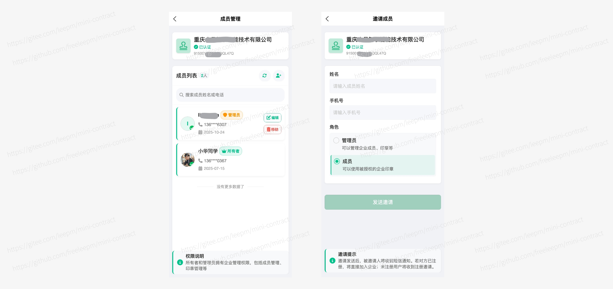

> Administrators can also manage members


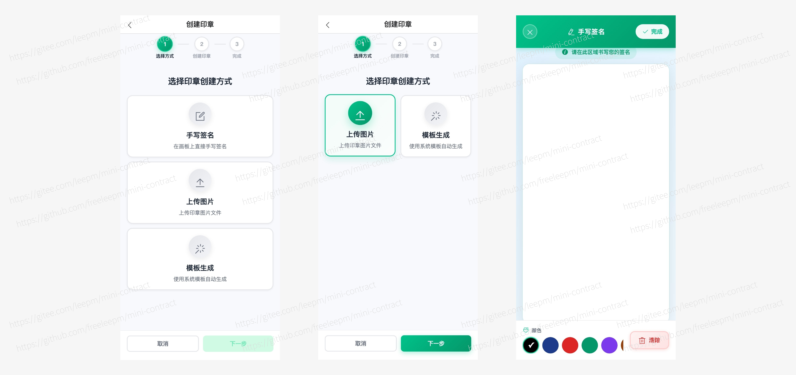

> Users can create their own seals, supporting upload, handwriting, template generation, etc.


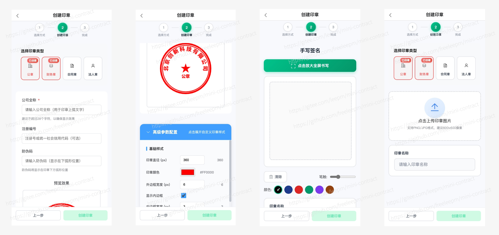

> Enterprise users support uploading and template generation of enterprise seals, and the number of seals of the same type is also limited; 


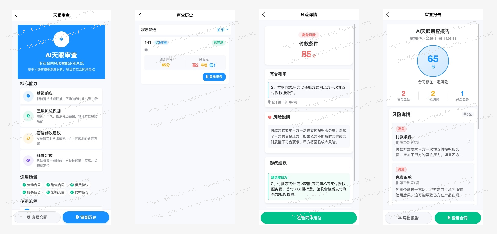

> Supports intelligent audit of contracts, provides corresponding audit reports, and provides users with intelligent analysis of risk levels for reference;


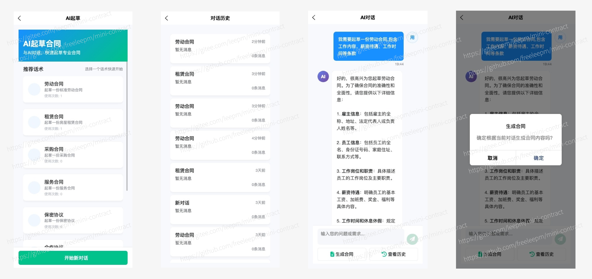

> For some personalized customers who hope to draft personalized contracts themselves, we currently support intelligent drafting through AI;


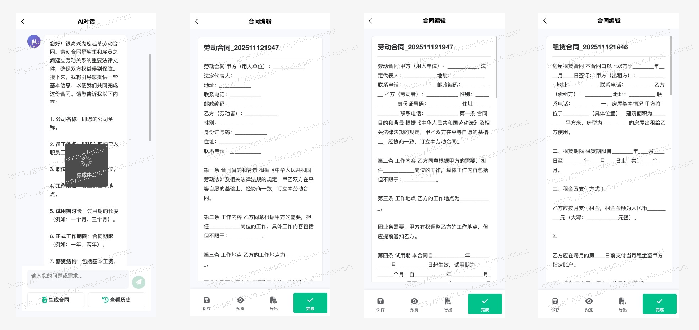

> Drafted contract drafts can be edited and adjusted online to better meet your personalized needs;


#### User Portal (Web)

> User web portal, you can sign and view your contracts in the backend


> PC also supports login via mobile phone number + password and SMS verification code;


> The workspace supports viewing basic contract information


> View all contract information, supports online signing and viewing contract progress status


> Create and manage personal seals and enterprise seals by yourself 


 
 

> Administrators support creating contract templates


> Administrators can invite enterprise employees


> View personal basic information


#### Platform Portal

> Coming soon.....


### Recent Updates

##### V 3.0 Pro Version
- [x] 【New】Brand new page design style
- [x] 【New】Brand new technical architecture
- [x] 【New】Tianyan Audit (Intelligent contract review)
- [x] 【New】AI Drafting (AIGC contract generation)


### Technical Documentation

* Online Demo:


### Star Trend

[](https://star-history.com/#freeleepm/mini-contract&Date)


### Communication and Cooperation

If you have any ideas, opinions, or suggestions about the Mini Contract Pro product, or commercial cooperation needs, please scan the code to contact the Mini Contract Pro project team for further communication:


## Product Recognition

> Since the product was open-sourced, it has received attention and recognition from many friends, and we have ultimately reached some in-depth cooperation. Currently, we have cooperated with over 300+ partners, including both "enterprise" friends and some "individual independent developers"


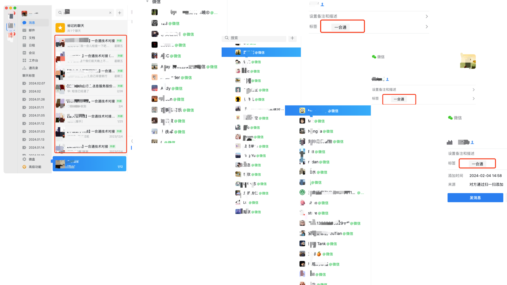
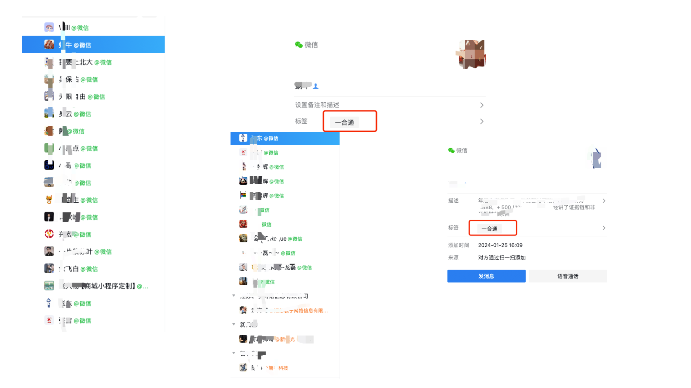
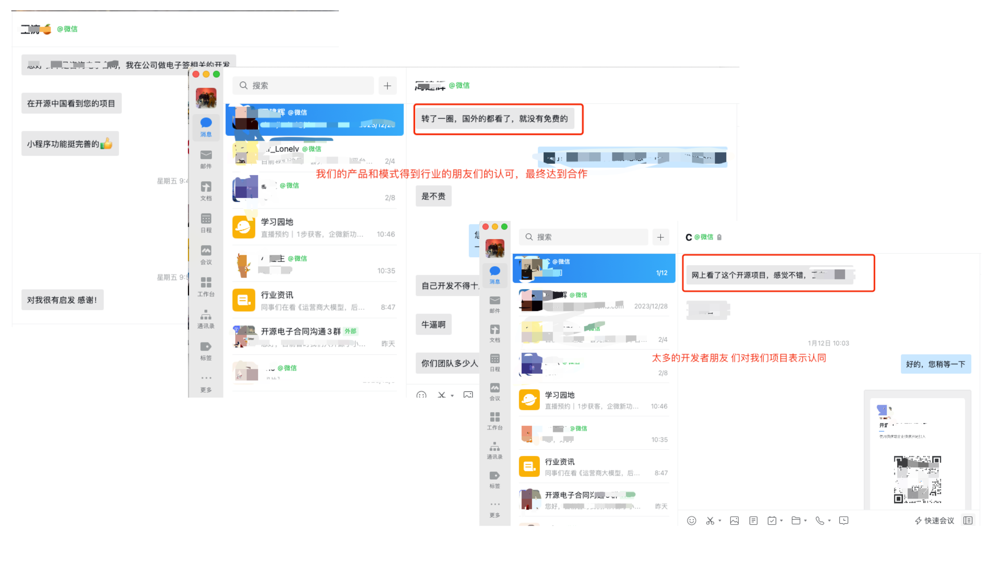
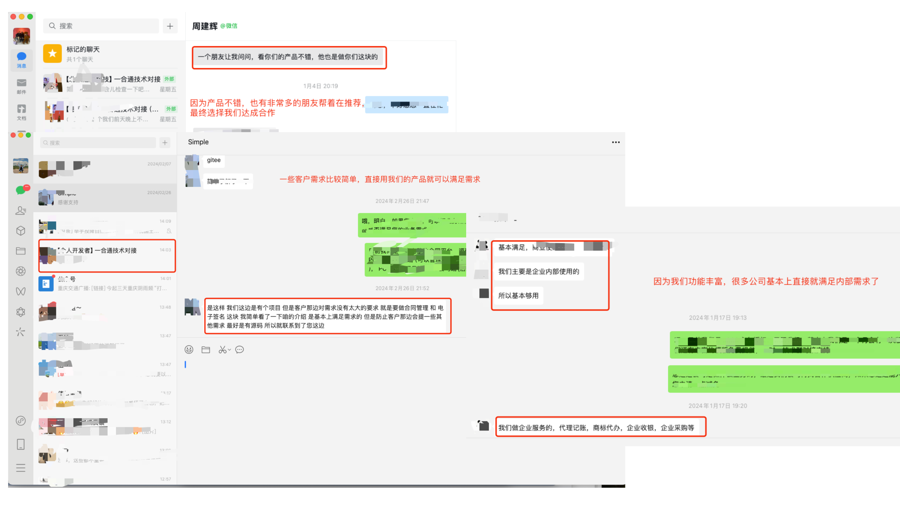
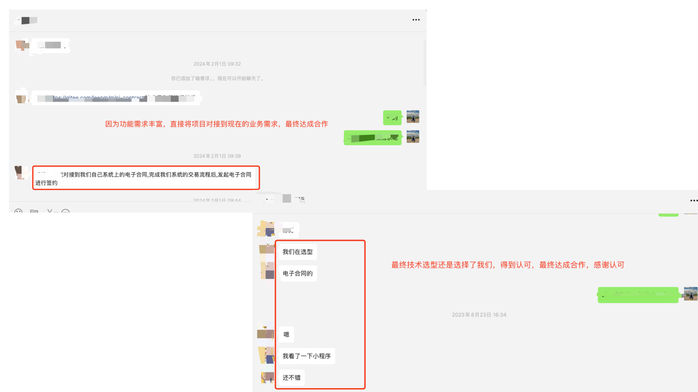


## Support Us

If you think this project is good, please Watch, Star, and Fork it ☺
