Mini-Contract(Free and Open Source Electronic Contracts)
===============

Current Latest Version: v2.1.0 (Release Date: 2025-02-06)

[](https://gitee.com/leepm/mini-contract/blob/master/LICENSE)[](https://gitee.com/leepm/mini-contract)[](https://gitee.com/leepm/mini-contract)[](https://github.com/freeleepm/mini-contract)[](https://github.com/freeleepm/mini-contract)[](https://gitee.com/leepm/mini-contract)[](https://gitee.com/leepm/mini-contract)


<h3 align="center">Mini-Contract</h3>

🚀🚀🚀 As a free and open-source product with independent intellectual property rights, Mini-Contract has always been committed to "making digital contract signing development simpler". At the same time, Mini-Contract is also an open-source electronic signature solution designed for developers. It innovatively adopts a "dual-mode engine" architecture and meets the needs of all scenarios from judicial-level contract signing to lightweight collaboration through a modular design. As the first open-source electronic signature platform to support both evidence chain and non-evidence chain dual modes, we have helped over 100 enterprise customers achieve digital transformation of their contract signing processes.


#### Dual-mode Engine (Flexible Scenario Adaptation)

**Judicial-grade Evidence Chain Mode**
Built on Ant Judicial Chain's blockchain-based evidence storage system, generates timestamped and digital-fingerprinted evidence reports for each contract, ensuring compliance with the "Electronic Signature Law". Certified by the National Industrial Information Security Development Research Center, particularly suitable for high-value scenarios like financial lending, HR contracts, and IP agreements, with millisecond-level response time for evidence queries.


**Lightweight Non-evidence Chain Mode**
Utilizes self-developed distributed storage technology with smart routing algorithms that reduce API call costs by 60%. Developers can achieve full lifecycle contract management without third-party evidence storage integration, ideal for high-frequency scenarios like internal approvals, supplier reconciliations, and rapid signings, supporting millions of daily signing requests.


#### Third-party developer-friendly

**Plug-and-Play Toolkit**
* Cloud-hosted e-signature/seal services
* Multi-party contract collaboration (supports 50+ signatories parallel operation)
* Smart perforated seal generation engine (pixel-level positioning accuracy)
* Omni-channel signing pages (Web/H5/Mini Program adaptive)

**Deep Open Capabilities**

* Multi-language SDKs (Java/Python/Go)
* Rich open API interfaces


### Why Choose Mini-Contract?

**All-in-One Integration Solution**
We integrate mainstream e-contract service providers (including but not limited to Fadada, eSign, Junzisign) with standardized API integration solutions. Developers can quickly connect multiple services through unified interfaces without separate vendor integrations, saving over 90% integration time. Pre-built vendor certification system helps accelerate compliance review.


**Cost Optimization Advantages**
Through bulk-purchasing scale effects, we offer more competitive interface pricing than official channels (15-30% average discount). Supports on-demand vendor combinations to avoid single-vendor lock-in risks, ensuring truly controllable costs.


**Enterprise-Grade Tech Architecture**
Built with Vue3 + TypeScript + Pinia:
- Modular design: On-demand loading of vendor features
- Responsive layout: Perfect PC/mobile dual-screen adaptation
- Configuration-driven development: 90% common requirements achievable through configuration
- Full TypeScript support: Comprehensive TS type definitions and API documentation

**Rapid Deployment (Out-of-Box Solutions)**
- Standardized UI component library: 30+ business-validated contract template components (commercially usable under MIT license)
- Full-process monitoring: End-to-end tracking from contract creation to archiving with evidence storage


### Commercial Licensing

The commercial version of the code is identical to the open-source version.

Commercial licensing is perpetual and supports lifelong upgrades.

For commercial use, please contact the technical team below for licensing details.


### Open Source Notice

1. Only allowed for personal study and research use.
2. Prohibited from selling the code and resources in any form or under any name.


### Business Scenarios

* **HR Companies:** Frequent contract signing scenarios with high costs of paper contracts, requiring bulk contract signing solutions  
* **Financial Institutions:** Online contract signing requirements with needs for maintaining timely and valid contract management that meets legal compliance  

* **Sales & Marketing Companies:** Scenarios requiring quick partnership establishment and immediate contract signing for online product sales collaborations  

* **Leasing Companies:** Needs for rapid contract signing with offline tenants, online contract management, query capabilities, and automatic renewal reminder systems  


Directory Structure
-----------------------------------

```
├─App.vue                           // Application configuration, used for configuring global styles and event listeners
├─index.html                        // Provides functionality for web page development and serves as a template
├─jsconfig.json                     // Configuration for code linting, etc.
├─main.js                           // Entry file
├─manifest.json                     //  Configuration for application name, appid, logo, version, etc.
├─pages.json                        // Configuration for page routes, navigation bars, tabs, and other page-related information
├─README.md                         // Help documentation
├─uni.scss                          // Pre-set SCSS variables for easy control of the application's style
├─vue.config.js                     // Development settings
├─api                               // Interface management, categorized by functionality
├─components                        // Public component library
│  ├─backTop                        // Back to top button
│  ├─BaseEmpty                      //  Empty page
│  ├─baseline                       // No more data
│  ├─btn-fixed                      // Fixed bottom component (slot)
│  ├─checkUser                      // Switch identity
│  ├─contractState                  // Contract status
│  ├─FileItem                       // File information
│  ├─loading                        // Page loading
│  ├─loadMore                       // Load more data
│  ├─SwitchEnvironment              // Switch environment
│  ├─tag-auth                       // User identity
│  ├─userInfo                       // User information
│  └─v-tabs                         // Tab switch
├─config                            //  Configuration
│  ├─config.js                      // System configuration (domain, etc.)
│  ├─net.config.js                  // Domain configuration
│  └─setting.js                     // Other global configurations (e.g., page sharing messages)
├─filters                           // Filters
├─mixins                            // Mixins
│  └─share.js                       // Page sharing
├─pages                             // Page folders
│  ├─contract                       // Contract-related pages
│  │  ├─index.vue                   // Contract home
│  │  │    └─index.vue              // Contract details
│  │  ├─sign                        // Initiate signing
│  │  └─revoke                      // Revoke contract
│  ├─home                           // Home
│  │  └─contractTemplate            // Contract templates
│  ├─index                          // Start page
│  ├─login                          // Login and registration
│  └─user                           // My account
│     ├─company                     // Company-related
│     │    ├─addCompany.vue         // Add company
│     │    ├─addSeal.vue            // Add seal
│     │    ├─authorize.vue          // Web-view page
│     │    ├─Certification.vue      // Company certification
│     │    ├─companySeal.vue        // Company seal management
│     │    ├─create.vue             // Create company (deprecated)
│     │    ├─myCompany.vue          // My company
│     │    └─removeComfirm.vue      // Remove company
│     ├─companyMembers              // Members
│     │    ├─createMember.vue       // Add member
│     │    └─index.vue              // Company members
│     ├─createUser                  // Signers
│     │    ├─addPerson.vue          // Add recent signers (deprecated)
│     │    └─index.vue              // Recent signers
│     ├─file                        // File management
│     ├─package                     // Packages
│     │    ├─buy.vue                // Purchase packages
│     │    └─comboDetails.vue       // My packages
│     ├─personal                    // Personal
│     │    └─Certification.vue      // Personal certification
│     └─setting                     // Settings
│          ├─changeIdentity.vue     // Switch identity (deprecated)
│          ├─password.vue           // Change password (deprecated)
│          └─Privacy.vue            // Privacy statement
├─static                            // Static resources storage, such as images, videos
│  └─tabbar                         // Tabbar icons
├─store                             // State management library
├─style                             // Public style library
├─uni_modules                       // Project components, pages, common modules, etc.
├─unpackage                         // Build directory
└─utils                             // Utilities
   ├─cache.js                       // Cache management
   ├─common.js                      // Common functions
   ├─compress.js                    // Image compression
   ├─reg.js                         // Common regular expressions
   └─request.js                     // Network request settings
```


Technical Architecture
-----------------------------------

#### Development Environment

- Language: Vue 2.0

- IDE (Front-end): VSCode, HBuilder

- Dependency Management: npm


#### Mobile Framework

| Description       | Framework       | Description       | Framework       |
| ------------------ | --------------- | ------------------ | --------------- |
| Basic Framework    | uni-app         | JavaScript Version | ES6             |
| Basic JS Framework | Vue.js          | Video Player      | Native video    |
| Routing Management | Vue Router      | State Management  | Vuex            |
| Network Requests  | axios           | CSS Pre-processing | SCSS            |
| Map Engine        | map             |                  |                 |


### Function Modules

```
Business Functions
├─Login and Registration
│  ├─Account Method
│  └─WeChat Authorization
├─Home
│  ├─Quick Contract Handling
│  │  ├─To Be Processed by Me
│  │  └─To Be Processed by Others
│  └─Recent Contracts
├─Contracts
│  ├─To Be Processed by Me
│  ├─To Be Processed by Others
│  ├─Completed
│  ├─Rejected
│  ├─Revoked
│  └─Overdue
├─Initiate New Signing Contracts
└─My Account
   ├─My Company
   ├─Company Seals
   ├─File Management
   ├─Package Management
   ├─Privacy Policy
   ├─Change Password
   └─Personal Center
      ├─Company Packages
      └─Personal Packages
```


Project Screenshots
----


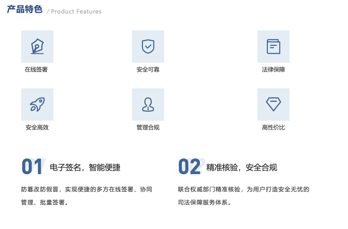


#### User Interface (Mobile)

> The homepage allows for quick initiation of contract signing, supporting multiple selections of signatories or companies (i.e., simultaneous signing by multiple individuals or companies), and also enables setting the validity period of the contract for this signing, thereby avoiding potential legal risks.


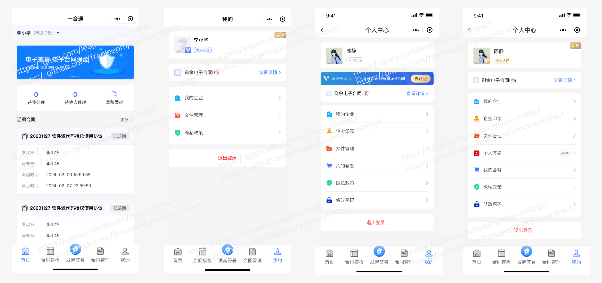


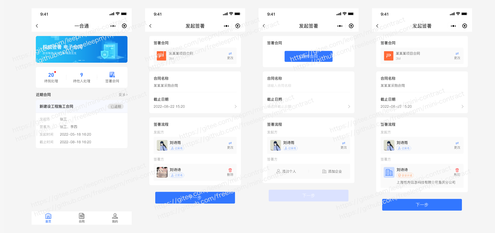


> As an enterprise, you need to complete "enterprise authentication" and "legal representative real-name authentication" before signing. Additionally, if the quota is used up during the usage, you can purchase more quota on your own.


> After logging into the application, you can access various features such as enterprise management, seal management, document signing management, signing quota purchase, and more.


> Users or businesses can independently set and upload their own personalized signatures and seals.


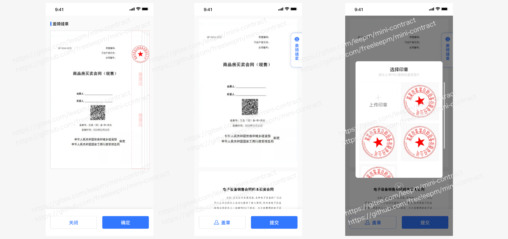


> Before signing, individuals are required to complete "real-name authentication," "ID card verification," "facial recognition," and other processes to ensure the authenticity of the information.


> In the signing details, you can view the signing status information of the contract signatories and all parties involved. The signing parties can also click to sign the document, with signing methods including "handwritten signature" and "seal" options. 


> As an enterprise administrator, you have the ability to manage members of the organization and grant them the authority to sign documents


> After completing the real-name authentication process for the enterprise, you can automatically generate compliant CA certificate signatures. As an enterprise administrator, you can set different signing permissions for each member.


> The platform provides a wide range of rich contract templates for your use, and we regularly update these templates. As a developer, you can enjoy these templates for free.


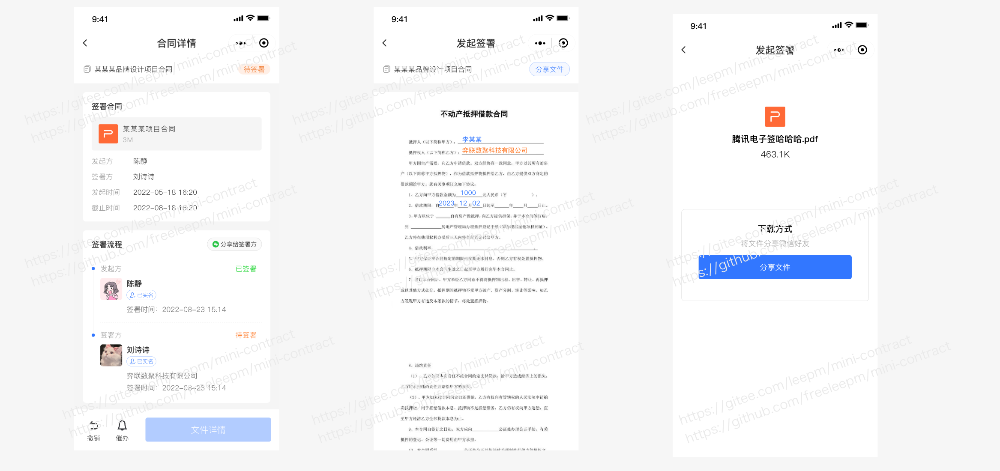


> Batch initiating signature, one-to-many, generating multiple contracts, with fixed data for one party and variable data for the other party/parties. After setting the parameters, multiple contracts can be generated simultaneously, improving the efficiency of initiating contracts (applicable to industries such as human resources where one company entity remains the same but multiple other parties need to sign).


> To quickly create contracts, you can use the option of generating an online contract directly, eliminating the hassle of downloading and then uploading the contract.


> Even before signing the contract, it is possible to support the management and uploading of temporary contract files (you can think of it as using our platform as a cloud storage, haha).

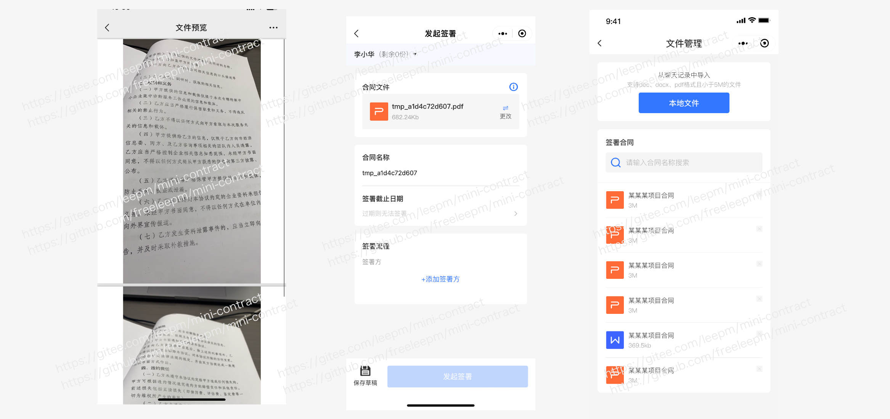


> Simultaneously, the current capability supports batch contract signing (primarily targeting business scenarios where one party's information remains constant while the other party's information varies, such as scenarios with a fixed Party A and a variable Party B).


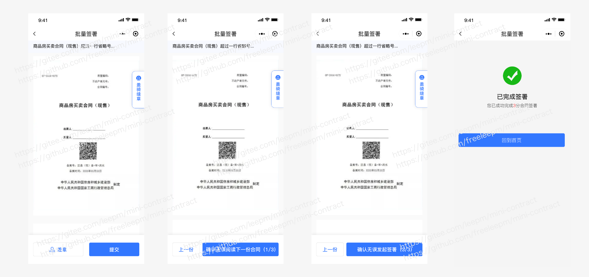


> Signatories involved in the contract can receive SMS reminders about the signing process. Within the validity period, they can click the link to access the H5 or mini program to complete the signing. Once all signatories have completed the signing, a text message notification will be sent to inform them.

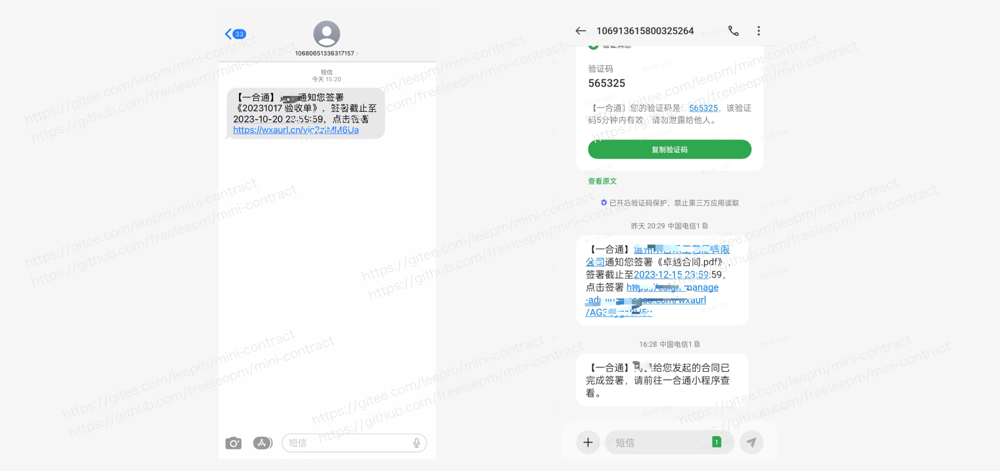


#### User Interface (Web)

> The web-based user interface allows users to sign and view their contracts in the backend.


> On the web user interface, there is support for signing contracts online. By clicking on "Sign," you will be redirected to the corresponding signing page.


> In English, it means "Handwritten signature and upload your unique personal signature information."

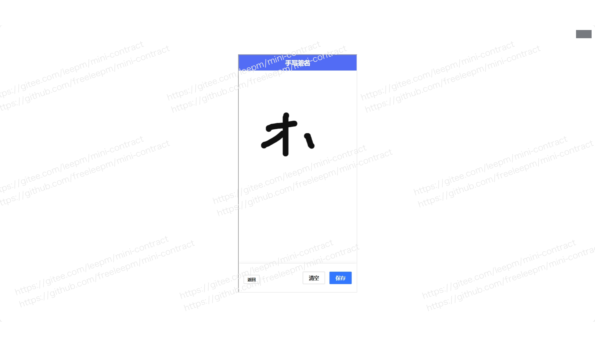

>  Web user interface supports switching between different identities, such as "personal" and "business".


> As a business manager, you can also manage members on the web platform.

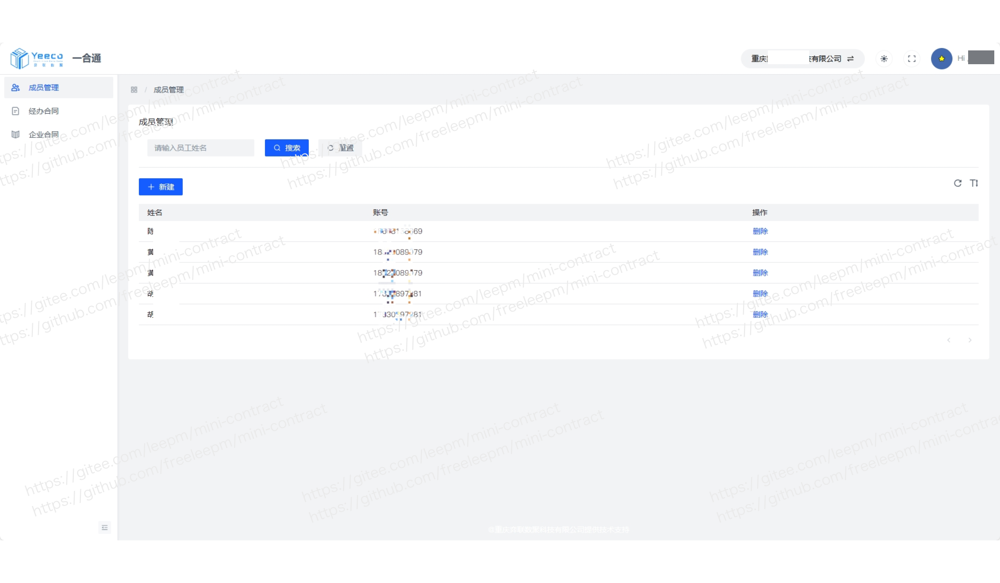


> Adding a member can be done by entering their "phone number" and "name".


>  On the web platform, you can also perform queries based on the status of contract signings, such as "Initiated by me", "Pending my action", "Pending others' action", "Completed", "Rejected", "Cancelled", and "Overdue".


> As a company manager or an individual, you can view all the signed and archived contracts on the web platform. It supports online viewing, downloading, and other operations.

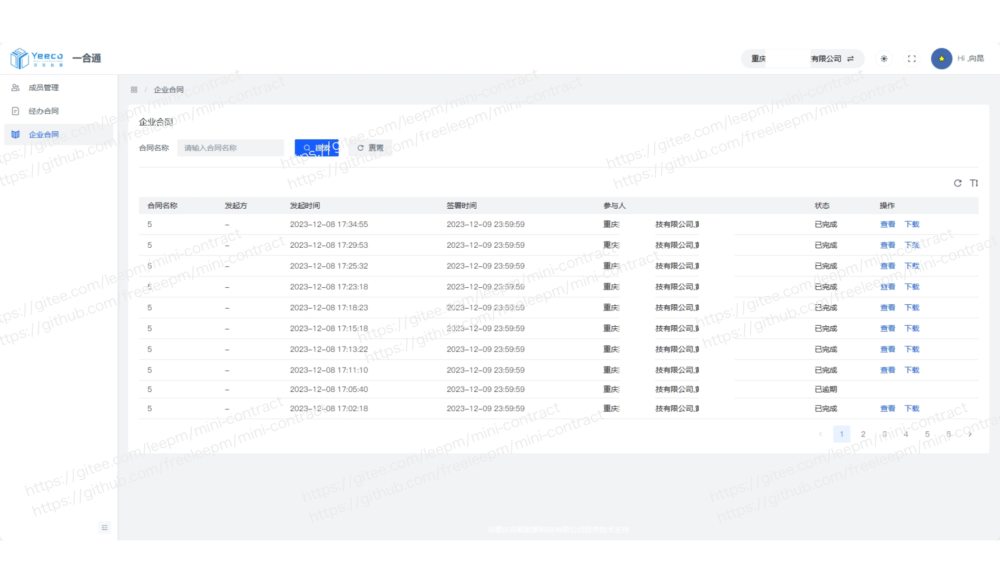


> The web management portal also supports operations such as changing accounts and modifying passwords.

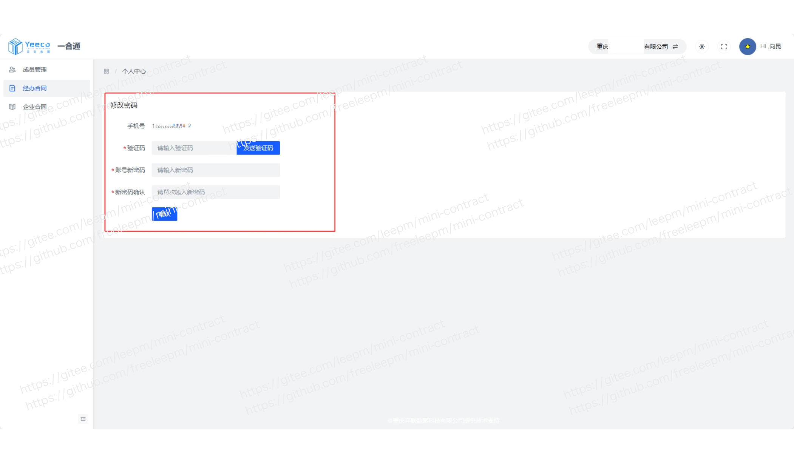


#### Platform Interface

***Data Overview***

> Gain insights into basic information about all users on the contract platform and aggregate and summarize data.

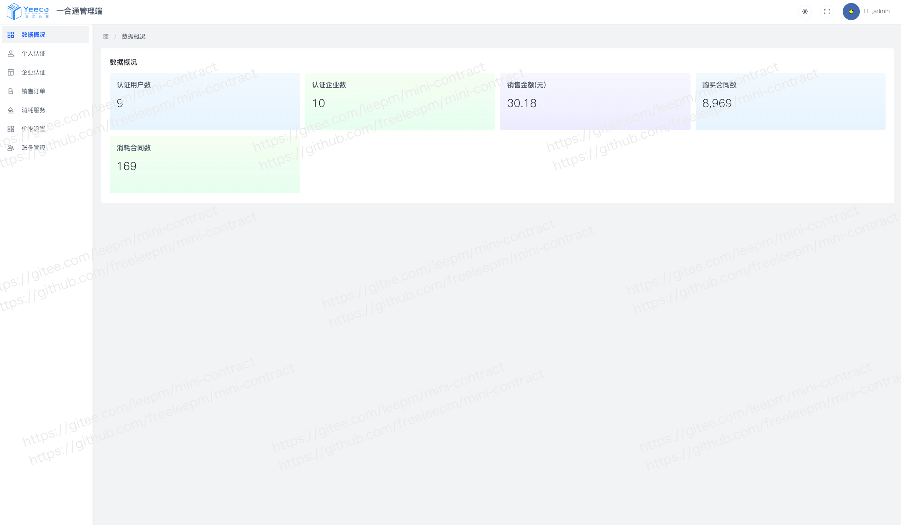

***Personal Certification***

> The platform can view desensitized basic information for all personal certifications.


***Company Certification***

> The platform can view desensitized basic information for all company certifications.

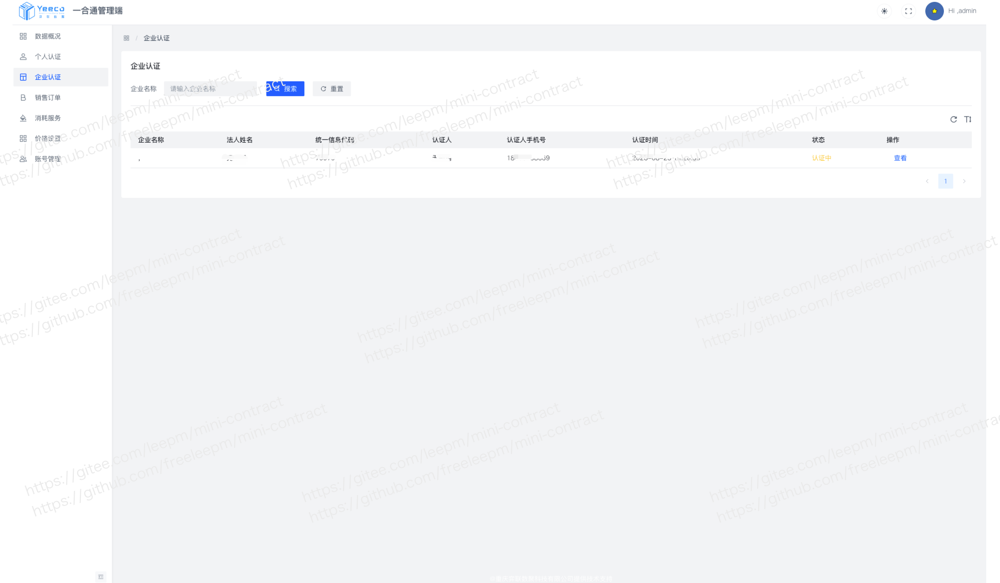

***Sales Orders***

> The platform can view all contract sales information.

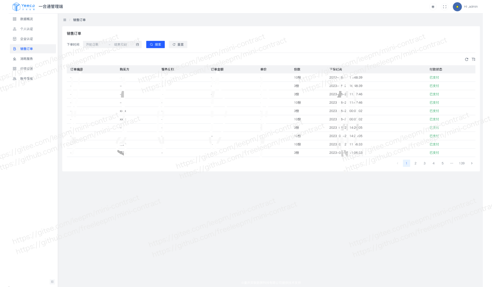

***Service Usage***

> The platform can view all contract usage and consumption information.


***Pricing Settings***

> The platform can set prices based on contract operational needs.

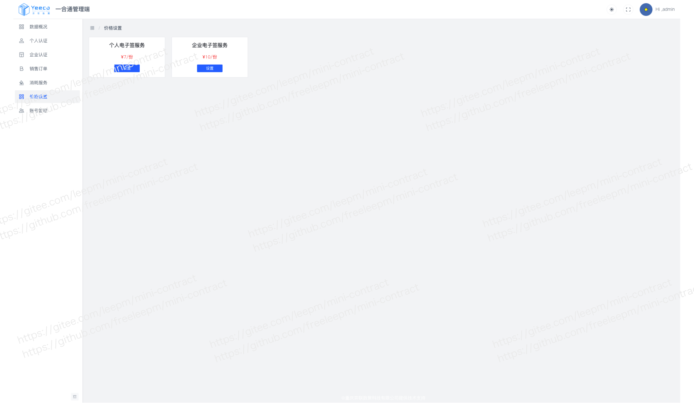

***Account Management***

> The platform can configure user permissions based on different roles.


***Sideways classification***

> The new operations platform allows for the independent operation of contract templates, making platform management more flexible and convenient. Once the operations platform establishes contract templates, all contract users and businesses can benefit from the pre-set templates provided by the operations platform.


>  When setting up the contract template, it is possible to pre-set the signatory roles as "individual" or "enterprise". Currently, a single template supports up to 10 signatory objects.

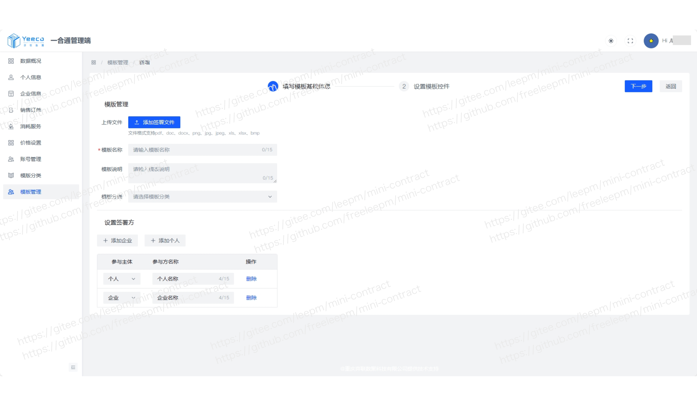


> The contract template supports dynamically setting parameter information inside it, and it can also pre-set some parameter information in advance, greatly increasing the flexibility of the contract.

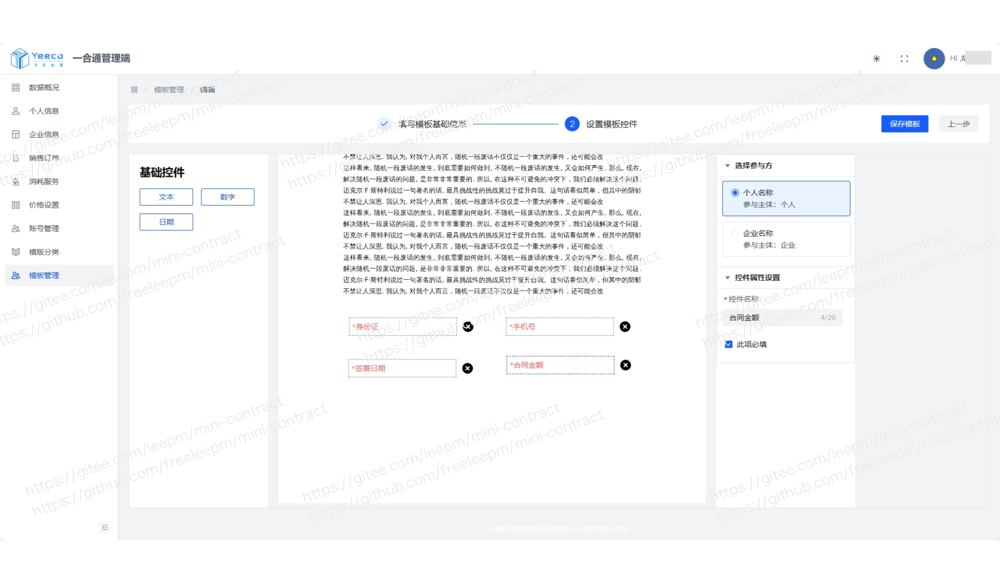


### Operation Demonstration (Mini Program version)

> Chain of Evidence

<div align="center" >
    
</div>


> Non-Chain of Evidence

<div align="center" >
    
</div>


### Updates Logs

##### v 2.0.0

[New] Introducing a brand new page style, enhancing the overall user experience.

- [x] **[New]** Support for one-to-many bulk contract initiation, improving efficiency in scenarios where a single entity corresponds to multiple signatories.
- [x] **[New]** Support for personalized signatures, allowing users to define their own signature styles.
- [x] **[New]** Intelligent rapid contract generation, enabling quick generation of online contracts through mobile phone camera or image upload.
- [x] **[New]** Drafts feature to address interruptions during the signing process.
- [x] **[New]** Initiator reminders to ensure contracts are signed within the valid period.
- [x] **[New]** File management feature for temporary file storage, doubling as a cloud drive.
- [x] **[New]**  Convenient share button on the contract details page for quick sharing with signatories.
- [x] **[Optimization]** Other user experience improvements.
- [x] **[Bug Fix]** Known bugs have been addressed.


##### v 1.5.5 

- [x] **[New]** Added "ID Card Comparison" in the real-name authentication process
- [x] **[New]** Send SMS notifications to signing parties upon completion
- [x] **[New]** Support for signing parties who are not the initiators (can delegate contract initiation)
- [x] **[Optimization]** Improved experience for switching between corporate and individual ID cards
- [x] **[Optimization]** Enhanced user experience
- [x] **[Bug Fix]**  Fixed known issues


#####  v 1.5.0
- [x] **[New]** Added non-evidence chain contract signing (suitable for daily internal approval within enterprises)
- [x] **[Optimization]** Seal management
- [x] **[Optimization]** Corporate real-name authentication logic
- [x] **[Optimization]**  Evidence chain multi-channel signing logic
- [x] **[[Upgrade]**  Third-party plugin version
- [x] **[Optimization]** Privacy protection agreement content
- [x] **[Optimization]** User experience
- [x] **[Bug Fix]**  Fixed known issues


##### v 1.1.2

- [x] **[New]**  Added support for backend management to view enterprise contract information
- [x] **[Optimization]** Improved user experience
- [x] **[Bug Fix]**   Fixed known issues


##### v 1.1.1 

- [x] **[Optimization]** Adjusted the number of electronic contract packages for enterprises and individuals
- [x] **[Optimization]** Improved user experience
- [x] **[Bug Fix]**  Fixed known issues


##### v 1.1.0 

- [x] **[New]** Added a variety of contract templates
- [x] **[New]** In-app contract signing for improved user experience
- [x] **[New]** SMS notifications for signatories to avoid delayed communication
- [x] **[Optimization]** Enhanced user experience
- [x] **[Bug Fix]**  Fixed known issues


### Technical Documentation

* Online Demo：


### Contact and Collaboration

If you would like to join our open-source discussion group, please scan the QR code to add the Mini-Contract project team and join the group chat:


If you have any ideas, suggestions, or business collaboration needs regarding the Mini-Contract product, please scan the QR code to add the Mini-Contract project team for further communication:


## Donations

If you find it useful, please consider Watching, Starred, and Forked ☺

