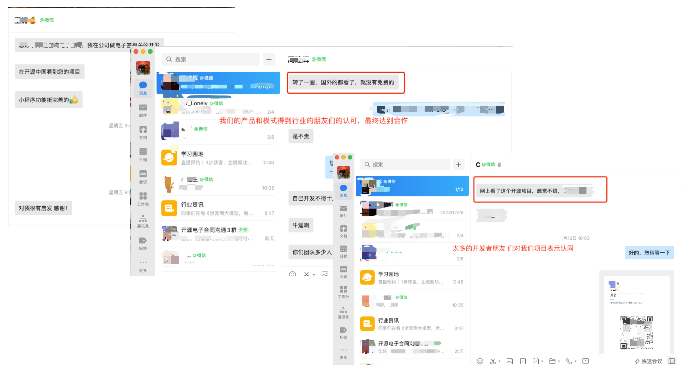

  Mini Contract Pro(免费开源电子合同)
  ===============


当前最新版本：v3.0.0 (发布时间：2025-11-22)

[](https://gitee.com/leepm/mini-contract/blob/master/LICENSE)[](https://gitee.com/leepm/mini-contract)[](https://gitee.com/leepm/mini-contract)[](https://gitee.com/leepm/mini-contract)[](https://gitee.com/leepm/mini-contract)


<h3 align="center">Mini Contract Pro</h3>


🚀🚀🚀  作为一款拥有自主知识产权的免费开源产品，Mini Contract Pro始终坚持“让数字签约开发更简单”，同时Mini-Contract-Pro也是一款专为开发者设计的开源电子签解决方案，创新性地采用「双模式引擎」架构，通过模块化设计满足从司法级签约到轻量级协作的全场景需求。首创支持证据链与非证据链双模式的开源电子签平台，我们已帮助 100+企业客户实现合同签署流程的数字化转型。


####  双模式引擎（灵活应对业务场景）

**司法级证据链模式**

基于蚂蚁司法链构建的区块链存证体系，为每份合同生成包含时间戳、数字指纹的存证报告，确保合同符合《电子签名法》要求。该模式已通过国家工业信息安全发展研究中心认证，特别适用于金融借贷、人力资源合同、知识产权协议等高价值场景，存证查询响应速度达毫秒级。


**轻量级非证据链模式**

采用自研的分布式存储技术，通过智能路由算法降低60%的接口调用成本。开发者无需对接第三方存证机构即可实现合同全生命周期管理，特别适合内部审批、供应商对账、快速签约等高频次场景，单日可承载千万级签署请求。


#### 第三方开发者友好

**即插即用工具集**

* 电子签名/印章云端托管服务

* 多方合同协同编辑（支持50+签署方并行操作）

* 智能骑缝章生成引擎（像素级定位精度）

* 全渠道签署页面（Web/H5/小程序/APP 多端自适应）


**深度开放能力**

* 提供Java/Python/Go多语言SDK

* 开放丰富的API接口


### 为什么选择 Mini Contract Pro？

**一站式集成解决方案**
我们整合了市场上主流的电子合同服务商（包括但不限于法大大、e签宝、君子签等），提供标准化API对接方案。开发者无需逐个对接不同厂商，通过统一接口即可快速接入多家服务，节省90%以上的对接时间。已预置的厂商资质认证体系可帮助您快速通过合规审查。


**成本优化优势**
通过集中采购的规模效应，我们为开发者提供比官方渠道更优惠的接口价格（平均优惠15%-30%）。支持按需选择服务商组合，避免单一厂商绑定风险，真正实现成本可控。


**企业级技术架构**
基于Vue3 + TypeScript + Pinia构建，采用：

- 模块化设计：支持服务商功能按需加载
- 响应式布局：完美适配PC/移动双端
- 配置化开发：90%常见需求可通过配置实现
- 完整类型支持：完善的TS类型定义和接口文档


**快速落地能力（提供开箱即用的解决方案）**

- 标准化UI组件库：含30+经过业务验证的合同模版组件（MIT协议可商用）
- 全链路监控：从合同创建到归档的全过程追踪和存证


### 商业授权

1. 商业版本与开源版本代码一致，没有区分；
2. 商业授权模式为永久授权，支持永久升级；
3. 商业使用需要授权，授权方式可选择联系下方技术同学。


### 开源须知

1. 仅允许用于个人学习研究使用；
2. 禁止将本开源的代码和资源进行任何形式任何名义的出售。


### 业务场景

* **人力资源公司：**频繁签署合同，纸质合同成本高，批量签署合同的业务场景
* **金融公司：**通过线上完成合同签署，留存有及时有效的合同管理合同

* **市场销售签单公司：**对一些网络销售的产品进行销售的时候，需要快速达成合作，立刻签署合同的场景

* **租赁公司：**需要对一些线下租赁公司进行快速合同签署，线上合同管理，查询和合同到期自动提醒的场景


目录结构
-----------------------------------

```json
mini-contract-pro/
├── App.uvue                        // 应用配置，全局样式和生命周期管理
├── main.uts                        // 应用入口文件
├── index.html                      // H5开发模板
├── manifest.json                   // 应用打包配置（应用名称、appid、版本等）
├── pages.json                      // 页面路由配置、导航栏、选项卡等
├── package.json                    // 项目依赖管理
├── uni.scss                        // SCSS全局变量预置，统一应用风格
├── vue.config.js                   // 开发配置
├── README.md                       // 项目文档
│
├── api/                            // 接口管理层，按功能分类
│   ├── index.uts                   // API总入口，导出所有接口
│   ├── auth.uts                    // 认证相关接口
│   ├── config.uts                  // 配置管理
│   ├── auth/
│   │   └── login.uts               // 登录接口
│   ├── ai-draft/
│   │   └── index.uts               // AI起草相关接口
│   ├── contracts/
│   │   └── index.uts               // 合同管理接口
│   ├── drafts/
│   │   └── index.uts               // 草稿管理接口
│   ├── enterprise/
│   │   └── index.uts               // 企业管理接口
│   ├── seals/
│   │   └── index.uts               // 印章管理接口
│   ├── templates/
│   │   └── index.uts               // 模板管理接口
│   ├── mock/                       // 模拟数据
│   │   ├── index.uts
│   │   └── templates.uts
│   └── utils/
│       └── download.uts            // 下载工具函数
│
├── components/                     // 公共组件库
│   ├── README.md                   // 组件使用文档
│   ├── KycModal.uvue               // KYC认证弹窗组件
│   ├── EnterpriseKycModal.uvue     // 企业KYC认证弹窗
│   ├── H5LoadingContainer.uvue     // H5加载容器
│   ├── H5ErrorContainer.uvue       // H5错误容器
│   ├── KYC_GUARD_USAGE.md          // KYC守卫使用指南
│   ├── ENTERPRISE_KYC_MODAL_USAGE.md
│   └── H5_SERVICE_CHECK_GUIDE.md
│
├── pages/                          // 页面文件（按功能模块组织）
│   ├── login/
│   │   └── index.uvue              // 登录页
│   ├── register/
│   │   └── index.uvue              // 注册页
│   ├── index/
│   │   └── index.uvue              // 首页
│   ├── contract-manage/            // 合同管理模块
│   │   ├── index.uvue              // 合同列表
│   │   └── draft.uvue              // 草稿箱
│   ├── contract-create/            // 合同创建模块
│   │   ├── setup.uvue              // 创建设置
│   │   ├── file.uvue               // 文件上传
│   │   ├── image.uvue              // 图片上传
│   │   └── h5-create.uvue          // H5创建页
│   ├── contract-detail/            // 合同详情
│   │   └── index.uvue
│   ├── contract-form/              // 合同表单填写
│   │   └── h5-fill.uvue
│   ├── contract-sign/              // 合同签署模块
│   │   ├── index.uvue              // 签署页
│   │   └── h5-sign.uvue            // H5签署页
│   ├── contract-view/              // 合同查看
│   │   └── h5-view.uvue
│   ├── contract-review/            // 合同审核
│   │   └── index.uvue
│   ├── contract-audit/             // 合同审查（天眼审查）
│   │   ├── intro.uvue              // 审查介绍
│   │   ├── progress.uvue           // 审查进度
│   │   ├── report.uvue             // 审查报告
│   │   ├── risk-detail.uvue        // 风险详情
│   │   └── history.uvue            // 审查历史
│   ├── ai-draft/                   // AI起草模块
│   │   ├── index.uvue              // AI起草首页
│   │   ├── chat.uvue               // AI对话页
│   │   ├── editor.uvue             // 编辑页
│   │   ├── detail.uvue             // 详情页
│   │   ├── preview.uvue            // 预览页
│   │   └── history.uvue            // 历史记录
│   ├── template-market/            // 模板市场
│   │   └── index.uvue
│   ├── template-detail/            // 模板详情
│   │   └── index.uvue
│   ├── template-preview/           // 模板预览
│   │   └── index.uvue
│   ├── enterprise/                 // 企业管理模块
│   │   ├── list.uvue               // 企业列表
│   │   ├── add.uvue                // 添加企业
│   │   ├── detail.uvue             // 企业详情
│   │   ├── members.uvue            // 成员管理
│   │   ├── member-invite.uvue      // 邀请成员
│   │   ├── member-edit.uvue        // 编辑成员
│   │   ├── seals.uvue              // 企业印章管理
│   │   ├── seal-create.uvue        // 创建企业印章
│   │   └── seal-authorize.uvue     // 印章授权
│   ├── profile/                    // 个人中心模块
│   │   ├── index.uvue              // 个人中心首页
│   │   ├── personal-info.uvue      // 个人信息
│   │   ├── seals.uvue              // 个人印章管理
│   │   ├── seal-create.uvue        // 创建个人印章
│   │   ├── settings.uvue           // 设置
│   │   ├── notifications.uvue      // 通知
│   │   ├── packages.uvue           // 套餐管理
│   │   ├── help.uvue               // 帮助中心
│   │   └── about.uvue              // 关于应用
│   ├── kyc/                        // KYC认证模块
│   │   └── index.uvue
│   ├── agreement/                  // 协议页面
│   │   ├── user.uvue               // 用户协议
│   │   └── privacy.uvue            // 隐私政策
│   └── pdf-preview/                // PDF预览
│
├── utils/                          // 工具函数库
│   ├── date.uts                    // 日期处理工具
│   ├── network.uts                 // 网络请求工具
│   └── kyc-check.uts               // KYC检查工具
│
├── static/                         // 静态资源
│   └── [图片、字体等资源文件]
│
├── scripts/                        // 构建脚本
│   └── [构建相关脚本]
│
└── uni_modules/                    // uni-app插件模块
```


技术架构
-----------------------------------

#### 开发环境

- **应用名称**：捷易签

- **框架**：uni-app + Vue 3
- **语言**：UTS (TypeScript)
- **版本**：3.0.0
- **支持平台**：iOS、Android、H5、小程序、APP
- **IDE(前端)**：HBuilder


## 核心功能模块

### 1. 用户系统
- **登录/注册**：用户账号管理
- **实名认证**：个人KYC认证
- **企业认证**：企业级KYC认证

### 2. 合同管理
- **创建合同**：支持文件上传、图片上传、模板创建
- **合同列表**：查看所有合同，支持筛选和搜索
- **草稿管理**：保存未完成的合同草稿
- **合同详情**：查看合同完整信息
- **合同审核**：审核合同内容

### 3. 合同签署
- **签署流程**：支持多方签署
- **签名管理**：创建和管理个人签名
- **印章管理**：创建和管理个人/企业印章
- **签署进度**：实时查看签署状态

### 4. 天眼审查（AI审查）
- **审查介绍**：显示审查功能说明
- **审查进度**：实时显示审查进度
- **审查报告**：生成详细的风险分析报告
- **风险详情**：查看具体风险项
- **审查历史**：查看历史审查记录

### 5. AI起草
- **AI对话**：与AI进行对话式合同起草
- **编辑器**：编辑AI生成的合同
- **预览**：预览合同内容
- **历史记录**：查看历史起草记录

### 6. 模板系统
- **模板市场**：浏览可用的合同模板
- **模板详情**：查看模板详细信息
- **模板预览**：预览模板内容
- **模板使用**：基于模板创建合同

### 7. 企业管理
- **企业列表**：管理多个企业账户
- **企业详情**：查看企业信息
- **成员管理**：添加、编辑、删除企业成员
- **成员邀请**：邀请新成员加入企业
- **企业印章**：创建和管理企业级印章
- **印章授权**：控制成员对印章的使用权限

### 8. 个人中心
- **个人信息**：管理用户基本信息
- **个人印章**：创建和管理个人印章
- **设置**：应用设置和偏好
- **通知**：消息和通知管理
- **套餐管理**：查看和升级用户套餐
- **帮助中心**：常见问题和帮助文档
- **关于应用**：应用信息和版本

## 技术栈

### 前端框架
- **uni-app**：跨平台开发框架，支持iOS、Android、H5、小程序
- **Vue 3**：渐进式JavaScript框架
- **UTS**：TypeScript变种，用于uni-app开发

### 开发工具
- **@dcloudio/uni-ui**：uni-app官方UI组件库
- **@dcloudio/uniapp-cli**：uni-app CLI工具

### 样式系统
- **SCSS**：CSS预处理器，通过uni.scss实现全局变量管理
- **CSS Mask + SVG**：现代简约图标系统

## API接口管理

所有API接口统一管理在`api/`目录下，按功能模块分类：

- **认证接口**：`api/auth.uts`、`api/auth/login.uts`
- **合同接口**：`api/contracts/index.uts`
- **草稿接口**：`api/drafts/index.uts`
- **企业接口**：`api/enterprise/index.uts`
- **印章接口**：`api/seals/index.uts`
- **模板接口**：`api/templates/index.uts`
- **AI起草接口**：`api/ai-draft/index.uts`

### 印章管理API示例

```typescript
// 获取印章列表
getSealList(params: { identityType: number; enterpriseId?: number; })

// 个人印章操作
userSeal.create(data)
userSeal.update(data)
userSeal.delete(id)
userSeal.page(params)

// 企业印章操作
enterpriseSeal.create(data)
enterpriseSeal.update(data)
enterpriseSeal.delete(id)
enterpriseSeal.page(params)

// 企业印章授权
enterpriseSeal.grantCreate(data)
enterpriseSeal.grantDelete(id)
enterpriseSeal.grantList(sealId)
```

## 开发指南

### 环境配置

```bash
# 安装依赖
npm install

# 开发模式
npm run dev

# 构建生产版本
npm run build
```

### 页面开发

1. 在`pages/`目录下创建新页面文件（.uvue格式）
2. 在`pages.json`中配置页面路由
3. 使用`uni.navigateTo()`进行页面跳转

### 组件开发

1. 在`components/`目录下创建新组件（.uvue格式）
2. 在需要的页面中导入组件
3. 参考`components/README.md`了解现有组件

### API调用

```typescript
// 导入API
import { userSeal } from '../../api/seals/index';

// 调用API
userSeal.create(sealData)
  .then(res => {
    console.log('成功', res);
  })
  .catch(err => {
    console.error('失败', err);
  });
```

## 重要文档

- **组件文档**：`components/README.md`
- **KYC使用指南**：`components/KYC_GUARD_USAGE.md`
- **企业KYC文档**：`components/ENTERPRISE_KYC_MODAL_USAGE.md`
- **H5服务检查**：`components/H5_SERVICE_CHECK_GUIDE.md`
- **认证API文档**：`API_DOCS_APP_AUTH.md`

## 常见问题

### 如何添加新页面？
1. 在`pages/`目录下创建新文件夹和.uvue文件
2. 在`pages.json`中添加页面配置
3. 使用`uni.navigateTo()`导航到新页面

### 如何调用后端API？
所有API调用通过`api/`目录下的接口函数进行，确保统一的请求管理和错误处理。

### 如何使用KYC认证？
参考`components/KYC_GUARD_USAGE.md`和`components/ENTERPRISE_KYC_MODAL_USAGE.md`文档。

### 如何处理H5兼容性问题？
使用`H5LoadingContainer`和`H5ErrorContainer`组件包装H5页面，参考`components/H5_SERVICE_CHECK_GUIDE.md`。


项目效果
----


> 目前支持手机号和账号 2 种方式进行登录；
>
> 目前我们已支持 模版、文件、图片 等多多方式发起合同；
>
> 同时我们也支持 ai 起草合同；
>
> 天眼审核，主要是对合同进行风险审核；


> 模版中心支持预先设置丰富的合同模版供用户或者企业员工选择合同模版来快速创建合同；
>
> 用户在模版详情里面能一目了然的了解当前合同模版需要填写的数据与字段，这样就能很方便的知道这个模版与自己需求是否匹配；


> 文件上传创建合同，可设置相应的签署人，这里的签署人数量完全由合同发起人来设置；
>
> 支持多个图片上传之后合并成 pdf 之后再来创建合同，同样可设置相应的签署人，这里的签署人数量完全由合同发起人来设置；


> 完成相应创建合同的基本信息之后就可以发起创建合同；


> 合同管理支持不同状态的合同进行 tab 筛选，同时点击合同也能查看相应的合同明细


> 如果合同模版里面设置了在签署之前要填写表单信息，这个时候需要用户先填写完表单之后才能进行合同的签署；


> 在签署的时候支持骑缝章和自由印章和个人签署的设置；


> 用户的个人中心，支持切换当前企业


> 用户可以自由增加实名企业，创建企业的第一位用户就是该企业的超级管理员用户；
>
> 进入某个企业之后支持对这个企业的“合同创建”、“合同管理”、“成员管理”、“印章管理”等企业专属操作；
>
> 同时当未认证的企业还支持进行认证企业实名


> 管理人员可以对印章进行授权与管理操作；


> 管理人员也能对成员进行管理


> 用户可以创建自己的印章，支持上传、手写、模版生成等方式


> 企业用户支持上传、模版生成企业印章，同时同一类型的印章也是做了数量限制的； 


> 支持对合同进行智能审核，并给出相应的审核报告，同时对风险等级进行智能分析提供用户参考；


> 针对一些个性化客户，希望自己起草个性化的合同，目前是支持我们通过 ai 来进行智能起草；


> 针对已经起草的合同初稿可以进行在线编辑与调整，使期更加的满足自己的个性化需求；


#### 用户端（Web端）

> Web 用户端，可以在后台对自己的合同进行相应的签署和查看


> pc 端同样支持手机号+密码的方式与短信验证码的方式进行登录；


> 工作台支持查看基本的合同信息


> 查看 所有的合同信息，支持在线签署和查看合同进度情况


> 自行创建和管理个人印章和企业印章 


 
 

> 管理人员支持创建合同模版


> 管理人员可以邀请企业员工


> 查看个人的基本信息


#### 平台端

> 稍后更新中.....


### 最近更新

##### V 3.0 Pro 版本
- [x] 【新增】全新风格的页面设计
- [x] 【新增】全新技术架构
- [x] 【新增】天眼审查（智能合同审核）
- [x] 【新增】AI 起草（AIGC 合同生成）


##### V2.0.0 更新日志

- [x] 【新增】新增全新风格的页面，提升整体用户体验
- [x] 【新增】支持一对多批量发起合同，提升发起效率（用于一个主体对应多个不同签署人的业务地场景）
- [x] 【新增】支持个性签名，用户可定义自己的签名样式
- [x] 【新增】智能快速合同生成（通过手机拍照或者上传图片即可快速生成一份在线合同）
- [x] 【新增】草稿箱，解决因为某些事情打断了签署工作
- [x] 【新增】发起人催办，确保合同能在有效期内完成签署
- [x] 【新增】文件管理（用于临时保存文件，您也可以拿我们的来当云盘了，哈哈）
- [x] 【新增】合同详情页面便捷分享按钮，能快速分享给待签署人
- [x] 【优化】其它体验
- [x] 【修复】已知bug


##### V1.5.5 更新日志

- [x] 【新增】支持实名认证环节加入“人证对比”
- [x] 【新增】签署完成后短信通知参与签署方
- [x] 【新增】支持签署方可以不是发起方（可代发起合同）
- [x] 【优化】企业与个人身份证切换体验

- [x] 【优化】用户体验
- [x] 【修复】已知bug


##### V1.5.0 更新日志
- [x] 【新增】非证据链合同签署（可用于企业内部日常审批使用）
- [x] 【优化】印章管理
- [x] 【优化】企业实名认证逻辑
- [x] 【优化】证据链多渠道签署逻辑
- [x] 【升级】第三方插件版本
- [x] 【优化】隐私保护协义内容
- [x] 【优化】用户体验
- [x] 【修复】已知bug


##### V1.1.2 更新日志

- [x] 【新增】支持后台管理可查看企业合同情况
- [x] 【优化】用户体验
- [x] 【修复】已知bug


##### V1.1.1 更新日志

- [x] 【优化】企业和个人电子合同套餐份数
- [x] 【优化】用户体验
- [x] 【修复】已知bug


##### V1.1.0 更新日志

- [x] 【新增】丰富多样的合同模板
- [x] 【新增】应用内合同签署，提升用户体验
- [x] 【新增】签署方短信通知，避免消息不及时
- [x] 【优化】用户体验
- [x] 【修复】已知bug


### 技术文档

* 在线演示：


### Star走势

[](https://star-history.com/#freeleepm/mini-contract&Date)


### 交流合作

如果你有任何对 Mini Contract Pro 产品上的想法、意见或建议，或商务上的合作需求，请扫码添加 Mini Contract Pro 项目团队进一步沟通：


## 产品认可

> 从产品对外开源之后，得到了特别多朋友们的关注和认可最终我们也达成了一些深度的合作，目前我们已经合作超过300+以上的合作伙伴，这当中有“企业”的朋友也有一些“个人独立开发者”





## 给个鼓励

如果觉得还不错，请 Watching，Starred，Fork 吧 ☺
