  Mini-Contract(免费开源电子合同)
  ===============


当前最新版本：v2.1.0 (发布时间：2025-02-06)

[](https://gitee.com/leepm/mini-contract/blob/master/LICENSE)[](https://gitee.com/leepm/mini-contract)[](https://gitee.com/leepm/mini-contract)[](https://github.com/freeleepm/mini-contract)[](https://github.com/freeleepm/mini-contract)


<h3 align="center">Mini-Contract</h3>


🚀🚀🚀  作为一款拥有自主知识产权的免费开源产品，Mini-Contract始终坚持“让数字签约开发更简单”，同时Mini-Contract也是一款专为开发者设计的开源电子签解决方案，创新性地采用「双模式引擎」架构，通过模块化设计满足从司法级签约到轻量级协作的全场景需求。首创支持证据链与非证据链双模式的开源电子签平台，我们已帮助 100+企业客户实现合同签署流程的数字化转型。


####  双模式引擎（灵活应对业务场景）

**司法级证据链模式**

基于蚂蚁司法链构建的区块链存证体系，为每份合同生成包含时间戳、数字指纹的存证报告，确保合同符合《电子签名法》要求。该模式已通过国家工业信息安全发展研究中心认证，特别适用于金融借贷、人力资源合同、知识产权协议等高价值场景，存证查询响应速度达毫秒级。


**轻量级非证据链模式**

采用自研的分布式存储技术，通过智能路由算法降低60%的接口调用成本。开发者无需对接第三方存证机构即可实现合同全生命周期管理，特别适合内部审批、供应商对账、快速签约等高频次场景，单日可承载千万级签署请求。


#### 第三方开发者友好

**即插即用工具集**

* 电子签名/印章云端托管服务

* 多方合同协同编辑（支持50+签署方并行操作）

* 智能骑缝章生成引擎（像素级定位精度）

* 全渠道签署页面（Web/H5/小程序三端自适应）


**深度开放能力**

* 提供Java/Python/Go多语言SDK

* 开放丰富的API接口


### 为什么选择 Mini-Contract？

**一站式集成解决方案**
我们整合了市场上主流的电子合同服务商（包括但不限于法大大、e签宝、君子签等），提供标准化API对接方案。开发者无需逐个对接不同厂商，通过统一接口即可快速接入多家服务，节省90%以上的对接时间。已预置的厂商资质认证体系可帮助您快速通过合规审查。


**成本优化优势**
通过集中采购的规模效应，我们为开发者提供比官方渠道更优惠的接口价格（平均优惠15%-30%）。支持按需选择服务商组合，避免单一厂商绑定风险，真正实现成本可控。


**企业级技术架构**
基于Vue3 + TypeScript + Pinia构建，采用：

- 模块化设计：支持服务商功能按需加载
- 响应式布局：完美适配PC/移动双端
- 配置化开发：90%常见需求可通过配置实现
- 完整类型支持：完善的TS类型定义和接口文档


**快速落地能力（提供开箱即用的解决方案）**

- 标准化UI组件库：含30+经过业务验证的合同模版组件（MIT协议可商用）
- 全链路监控：从合同创建到归档的全过程追踪和存证


### 商业授权

1. 商业版本与开源版本代码一致，没有区分；
2. 商业授权模式为永久授权，支持永久升级；
3. 商业使用需要授权，授权方式可选择联系下方技术同学。


### 开源须知

1. 仅允许用于个人学习研究使用；
2. 禁止将本开源的代码和资源进行任何形式任何名义的出售。


### 业务场景

* **人力资源公司：**频繁签署合同，纸质合同成本高，批量签署合同的业务场景
* **金融公司：**通过线上完成合同签署，留存有及时有效的合同管理合同

* **市场销售签单公司：**对一些网络销售的产品进行销售的时候，需要快速达成合作，立刻签署合同的场景

* **租赁公司：**需要对一些线下租赁公司进行快速合同签署，线上合同管理，查询和合同到期自动提醒的场景


目录结构
-----------------------------------

```
├─App.vue                           // 应用配置，用来配置APP全局样式以及监听
├─index.html                        // 给网页开发提供的功能，提供模板
├─jsconfig.json                     // 规范配置等
├─main.js                           // 入口文件
├─manifest.json                     // 配置应用名称、appid、logo、版本等打包信息
├─pages.json                        // 配置页面路由、导航条、选项卡等页面类信息
├─README.md                         // 帮助文档
├─uni.scss                          // scss变量预置, 为了方便整体控制应用的风格
├─vue.config.js                     // 开发设置
├─api                               // 接口管理，按照功能分类
├─components                        // 公共组件库
│  ├─backTop                        // 返回顶部
│  ├─BaseEmpty                      // 缺省页
│  ├─baseline                       // 没有更多数据
│  ├─btn-fixed                      // 固定在页面底部组件（插槽）
│  ├─checkUser                      // 切换身份
│  ├─contractState                  // 合同状态
│  ├─FileItem                       // 文件信息
│  ├─loading                        // 页面加载
│  ├─loadMore                       // 加载数据
│  ├─SwitchEnvironment              // 切换环境
│  ├─tag-auth                       // 用户身份
│  ├─userInfo                       // 用户信息
│  └─v-tabs                         // tab切换
├─config                            // 配置
│  ├─config.js                      // 系统配置（域名等）
│  ├─net.config.js                  // 域名配置
│  └─setting.js                     // 其他全局配置（如：页面分享文案）
├─filters                           // 过滤器
├─mixins                            // 混入
│  └─share.js                       // 页面分享
├─pages                             // 页面文件夹
│  ├─contract                       // 合同相关页面
│  │  ├─index.vue                   // 合同首页
│  │  │    └─index.vue              // 合同详情
│  │  ├─sign                        // 发起签署
│  │  └─revoke                      // 撤销合同
│  ├─home                           // 首页
│  │  └─contractTemplate            // 合同模板
│  ├─index                          // 启动页
│  ├─login                          // 登录注册
│  └─user                           // 我的
│     ├─company                     // 企业相关
│     │    ├─addCompany.vue         // 添加企业
│     │    ├─addSeal.vue            // 添加印章
│     │    ├─authorize.vue          // web-view页面
│     │    ├─Certification.vue      // 企业认证
│     │    ├─companySeal.vue        // 企业印章管理
│     │    ├─create.vue             // 创建企业（已废弃）
│     │    ├─myCompany.vue          // 我的企业
│     │    └─removeComfirm.vue      // 移除企业
│     ├─companyMembers              // 成员
│     │    ├─createMember.vue       // 添加成员
│     │    └─index.vue              // 企业成员
│     ├─createUser                  // 签署
│     │    ├─addPerson.vue          // 添加最近签署人（已废弃）
│     │    └─index.vue              // 最近签署人
│     ├─file                        // 文件管理
│     ├─package                     // 套餐
│     │    ├─buy.vue                // 购买套餐
│     │    └─comboDetails.vue       // 我的套餐
│     ├─personal                    // 个人
│     │    └─Certification.vue      // 个人认证
│     └─setting                     // 设置
│          ├─changeIdentity.vue     // 切换身份（已废弃）
│          ├─password.vue           // 修改密码（已废弃）
│          └─Privacy.vue            // 隐私申明
├─static                            // 存放静态资源，如图片、视频
│  └─tabbar                         // tabbar图标
├─store                             // 状态管理库
├─style                             // 公共样式库
├─uni_modules                       // 项目组件、页面、公共模块等
├─unpackage                         // 打包目录
└─utils                             // 工具
   ├─cache.js                       // 设置缓存
   ├─common.js                      // 公共方法
   ├─compress.js                    // 图片压缩
   ├─reg.js                         // 通用正则表达式
   └─request.js                     // 网络请求设置
```


技术架构
-----------------------------------

#### 开发环境

- 语言：Vue2.0

- IDE(前端)： VScode、HBuilder

- 依赖管理：npm


#### 移动端框架

| 说明       | 框架       | 说明       | 框架      |
| ---------- | ---------- | ---------- | --------- |
| 基础框架   | uni-app    | JS版本     | ES6       |
| 基础JS框架 | Vue.js     | 视频播放器 | 原生video |
| 路由管理   | Vue Router | 状态管理   | Vuex      |
| 网络请求   | axios      | css预处理  | scss      |
| 地图引擎   | map        |            |           |


### 功能模块

```html
业务功能
├─登录注册
│  ├─账号方式
│  └─微信授权
├─首页
│  ├─快捷合同处理
│  │  ├─待我处理
│  │  └─待他人处理
│  └─最近合同
├─合同
│  ├─待我处理
│  ├─待他人处理
│  ├─已完成
│  ├─已拒签
│  ├─已撤销
│  └─已逾期
├─发起新签署合同
└─个人中心
   ├─我的企业
   ├─企业印章
	├─文件管理
   ├─套餐管理
	├─隐私政策
   ├─修改密码
   └─个人中心
      ├─企业套餐
      └─个人套餐
```


项目效果
----


#### 用户端（移动端）
> 首页能快速的发起合同的签署，签署人或者公司支持多选择（就是支持多人或者多公司同时签署），同时还能设置本次签署合同的有效果期，从而避免地一些法律风险


> 作为企业需要在签署之前完成“企业认证”、“法人实名认证”；同时在使用过程中如果额度用完，可自行购买额度


> 登录应用之后能查看到相应的功能，企业管理，印章管理，签署的文件管理，签署额度购买等等 


>  用户或者企业可自行设置和上传自己的个人性的签名，骑缝章

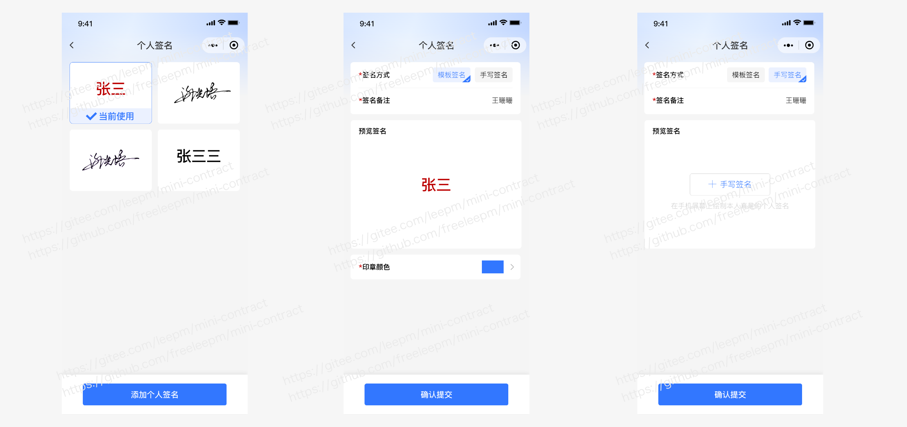


> 签署前如果是个人需要做“实名认证”、“人证比对”、“人脸识别”等，从而来确保信息的真实性

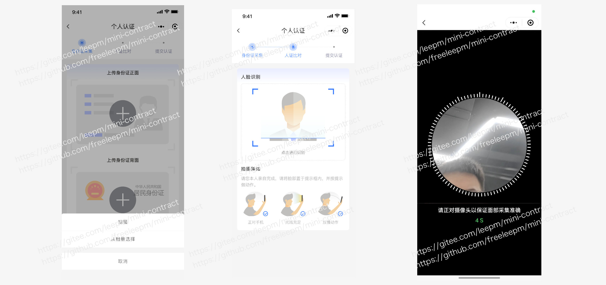


> 在签署详情里面能查看到合同签署人和各方签署的状态信息，同时签署方还可以点击进行签署，签署方式有“手写签名、盖章”等 

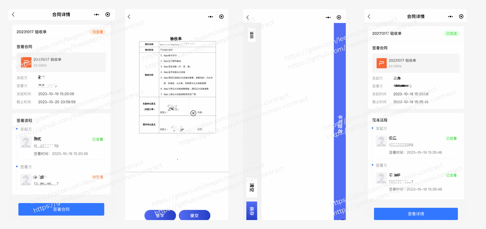


> 作为企业管理人员，可以管理企业成员，同时可以授权企业成员是否拥签署权限

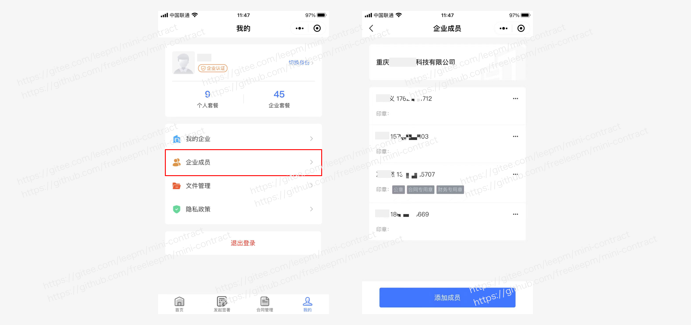


> 实名认证企业之后可自动生成合规的ca证书签章，企业管理人员可为每一个成员设置不同的签章权限


> 平台默认非常多非常丰富的合同模板，我们还会不定期更新模板，开发者或者可免费享用模板

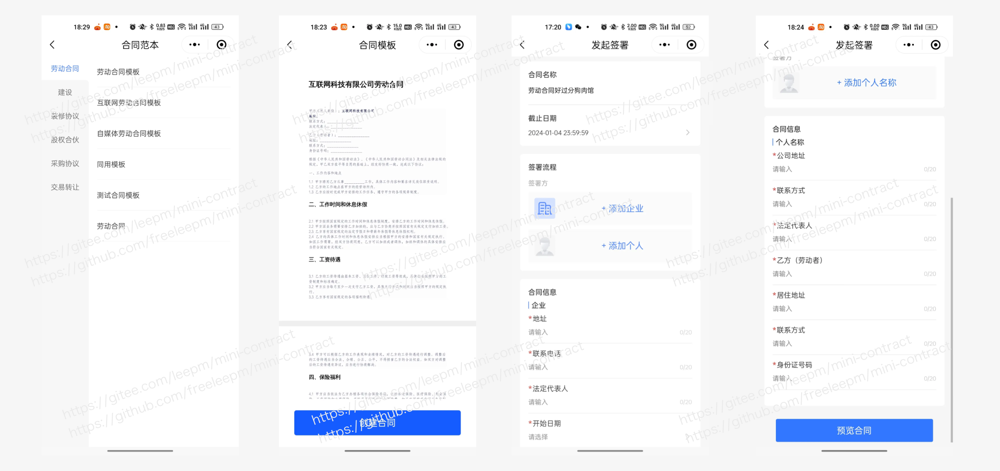


> 批量发起签署，一对多，生成多份合同，针对一方数据固定，另外一方或者多方不固定，统一设置之后，同时批量生成多份合同，提升发起合同效率（针对一些人力资源行业可以一个公司主体不变，对应多个其它方签署）

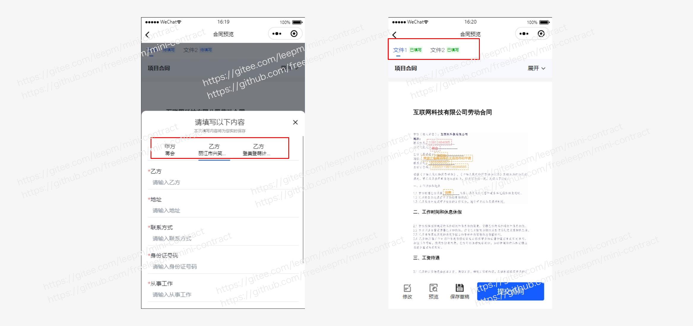


> 为了快速创建合同，可通通过快速生成一份在线合同，免去下载合同之后又上传的麻烦

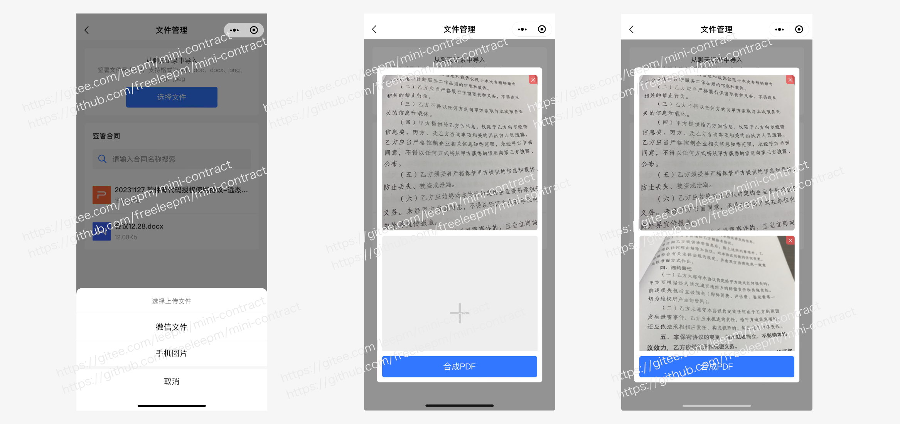

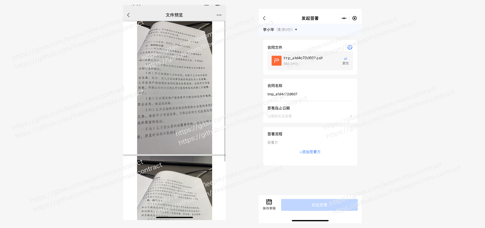


> 在未签署合同的时候，还可以支持临时合同文件的管理和上传（您可以拿我们的来当成云盘了，哈哈）


> 同时目前支持批量签署合同能力（主要是针对在一对多的签署场景当中，如：甲方信息固定，乙方信息不固定的业务场景）


> 参与签署的人可以收到签署的短信信息提醒，在有效期内点击链接可以到H5或者小程序里面进行签署，所有签署人都签署完成之后有短信通知提示


#### 用户端（Web端）

> Web 用户端，可以在后台对自己的合同进行相应的签署和查看

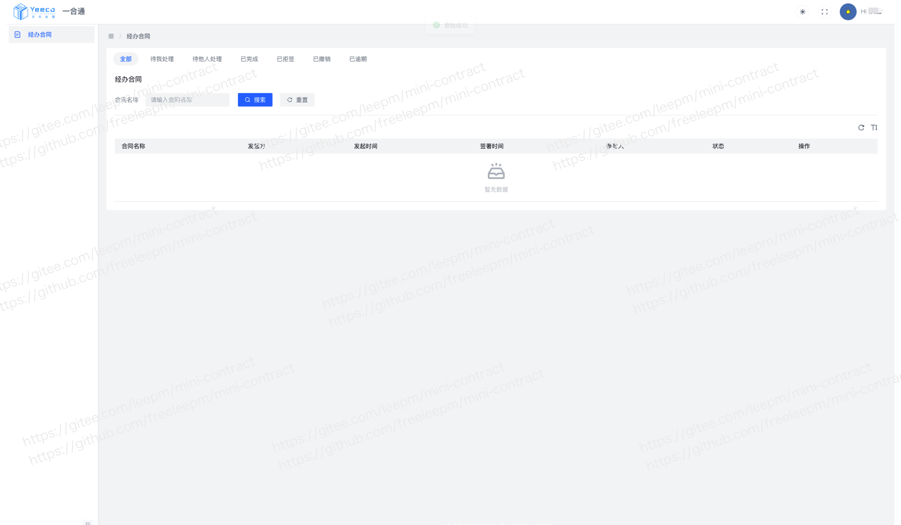


> Web 用户端，支持在线签署合同，点击“签署”跳转到相应的签署页面


> 手写签署，以及上传自己专属的个性签名信息 


> Web 用户端支持，“个人” 和 “企业” 不同身份的切换


> 作为企业管理人员，在Web端也能管理成员


> 输入"手机号"和“姓名”即可完成成员增加

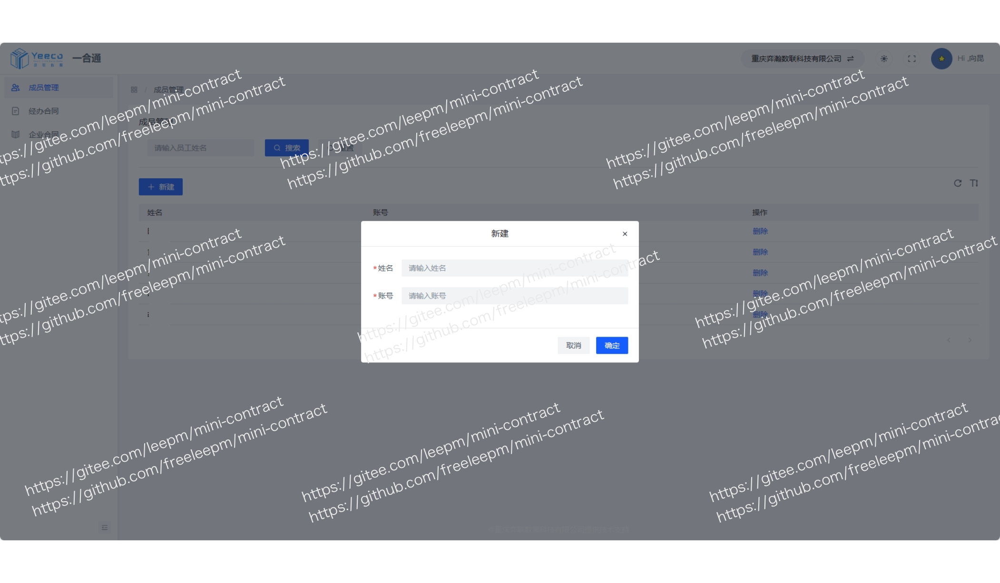


> 同时Web端还能根据合同签署的状态“我发起的”、“待我处理”、“待他人处理“、”已完成“、“已拒签”、“已撤销”、“已逾期” 进行查询

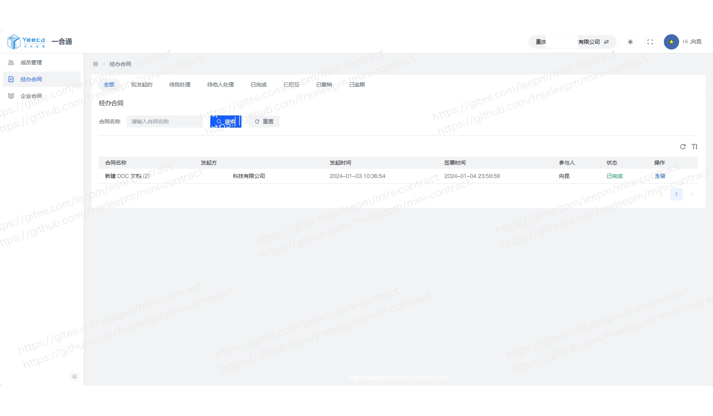


> 作为企业管理人员或者个人在Web端能查看到所有已经签署过并且归档的合同，支持在线查看，下载等操作


> Web管理端还支持账号的更换和密码的修改等操作


#### 平台端

***数据概况***

> 了解合同平台下所有使用者的基本信息，并对相应的数据进行综合概览汇总


***个人认证***

> 平台可查看到脱敏后的所有个人认证的基本信息

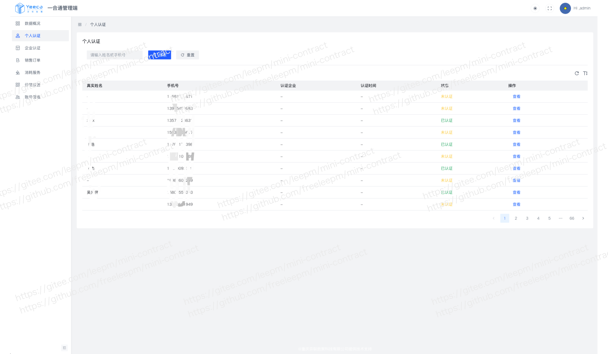


***企业认证***

> 平台可查看到脱敏后的所有企业认证的基本信息


***销售订单***

> 平台可查看所有合同销售情况


***消耗服务***

> 平台可查看到所有合同的使用和消费情况

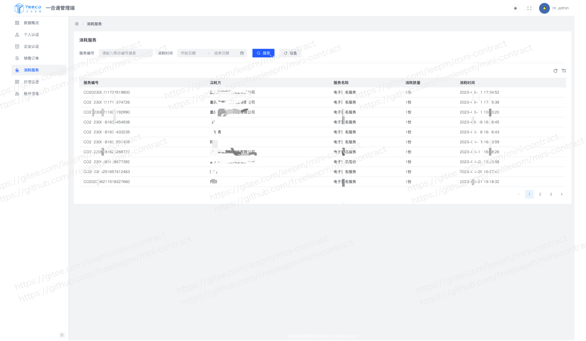


***价格设置***

> 平台可根据自己合同运营情况设置相应的价格，可单独对企业和个人的合同购买金额进行设置


***账号管理***

> 平台根据不同角色进行相应的用户权限设置，不同的用户有不同的管理权限

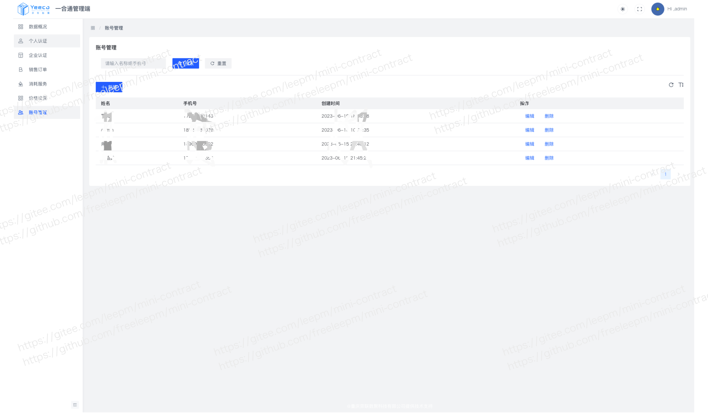


***横版分类***

> 新增运营平台可独立运营自己的合同模板，让平台管理更加灵活更方便，运营平台建立起了合同模板之后，所有合同用户和企业都可以享受到运营平台提前设置好的合同模板

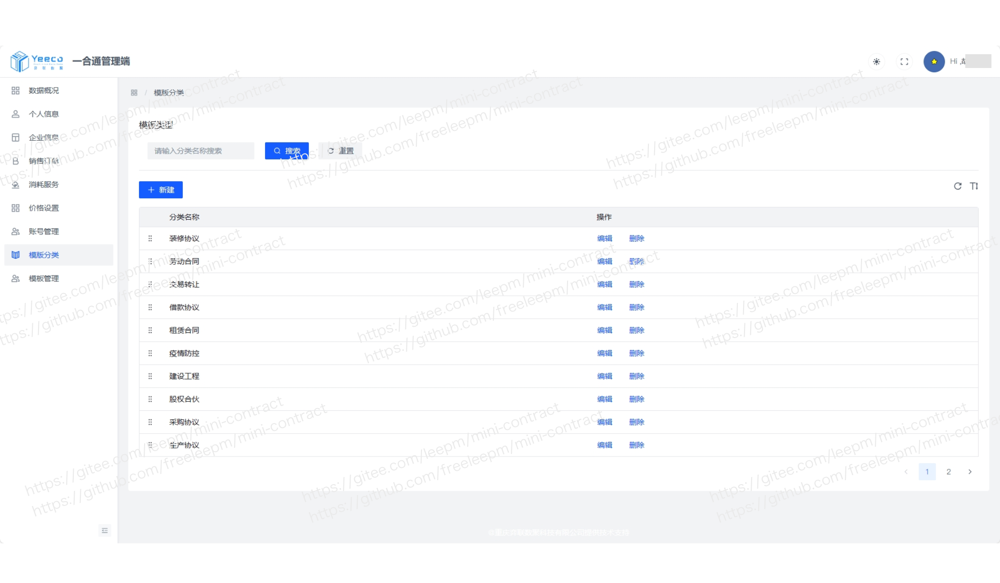

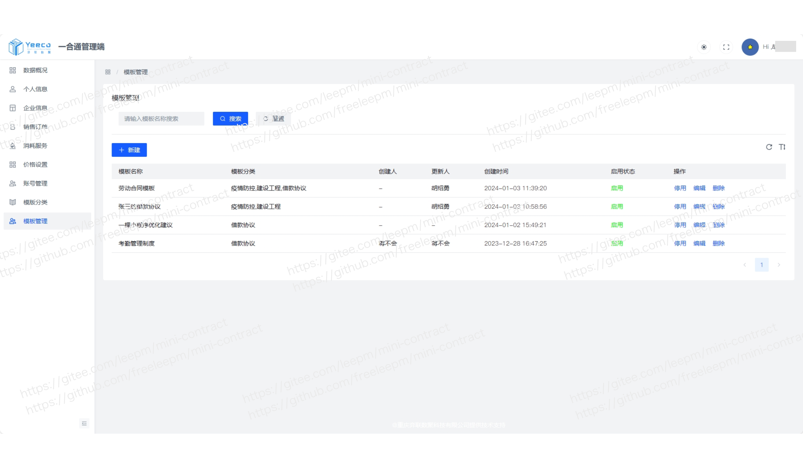


> 在设置合同横版的时候，可提前设置好该模板预设好的签署方“个人”、“企业”，目前单个横版最多支持10个签署对象


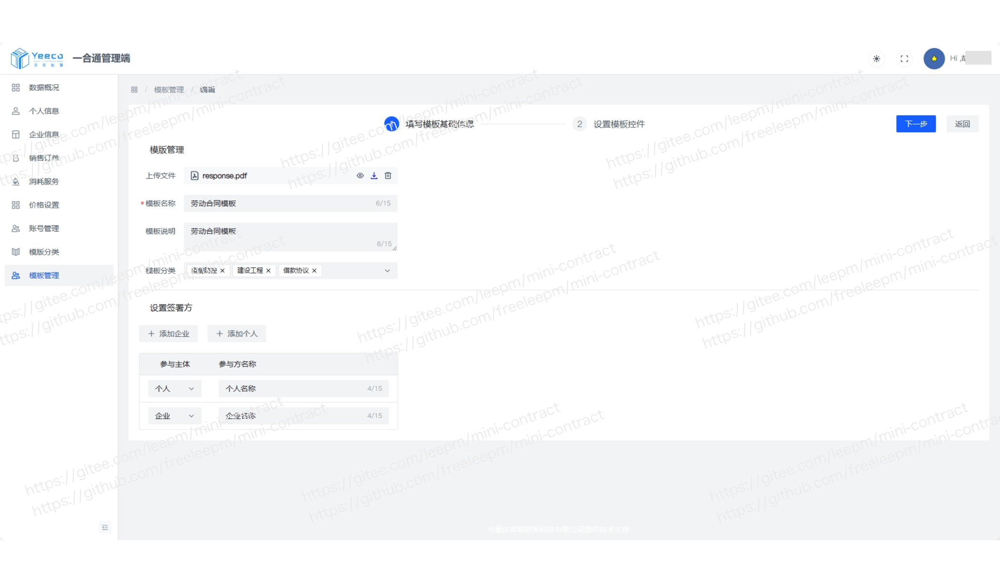


> 合同模板支持动态设置里面的参数信息，也可以提前预设一些参数信息，从而大大的增加了合同的灵活性


### 操作演示（小程序端）

> 证据链方式

<div align="center" >
    
</div>


> 非证据链方式

<div align="center" >
    
</div>


### 最近更新

##### V2.0.0 更新日志

- [x] 【新增】新增全新风格的页面，提升整体用户体验
- [x] 【新增】支持一对多批量发起合同，提升发起效率（用于一个主体对应多个不同签署人的业务地场景）
- [x] 【新增】支持个性签名，用户可定义自己的签名样式
- [x] 【新增】智能快速合同生成（通过手机拍照或者上传图片即可快速生成一份在线合同）
- [x] 【新增】草稿箱，解决因为某些事情打断了签署工作
- [x] 【新增】发起人催办，确保合同能在有效期内完成签署
- [x] 【新增】文件管理（用于临时保存文件，您也可以拿我们的来当云盘了，哈哈）
- [x] 【新增】合同详情页面便捷分享按钮，能快速分享给待签署人
- [x] 【优化】其它体验
- [x] 【修复】已知bug


##### V1.5.5 更新日志

- [x] 【新增】支持实名认证环节加入“人证对比”
- [x] 【新增】签署完成后短信通知参与签署方
- [x] 【新增】支持签署方可以不是发起方（可代发起合同）
- [x] 【优化】企业与个人身份证切换体验

- [x] 【优化】用户体验
- [x] 【修复】已知bug


##### V1.5.0 更新日志
- [x] 【新增】非证据链合同签署（可用于企业内部日常审批使用）
- [x] 【优化】印章管理
- [x] 【优化】企业实名认证逻辑
- [x] 【优化】证据链多渠道签署逻辑
- [x] 【升级】第三方插件版本
- [x] 【优化】隐私保护协义内容
- [x] 【优化】用户体验
- [x] 【修复】已知bug


##### V1.1.2 更新日志

- [x] 【新增】支持后台管理可查看企业合同情况
- [x] 【优化】用户体验
- [x] 【修复】已知bug


##### V1.1.1 更新日志

- [x] 【优化】企业和个人电子合同套餐份数
- [x] 【优化】用户体验
- [x] 【修复】已知bug


##### V1.1.0 更新日志

- [x] 【新增】丰富多样的合同模板
- [x] 【新增】应用内合同签署，提升用户体验
- [x] 【新增】签署方短信通知，避免消息不及时
- [x] 【优化】用户体验
- [x] 【修复】已知bug


### 技术文档

* 在线演示：


### Star走势

[](https://star-history.com/#freeleepm/mini-contract&Date)


### 交流合作

如果你想加入我们的开源交流群，请扫码添加 Mini-Contract 项目团队，加入群聊：


如果你有任何对 Mini-Contract 产品上的想法、意见或建议，或商务上的合作需求，请扫码添加 Mini-Contract 项目团队进一步沟通：


## 产品认可

> 从产品对外开源之后，得到了特别多朋友们的关注和认可最终我们也达成了一些深度的合作，目前我们已经合作超过200+以上的合作伙伴，这当中有“企业”的朋友也有一些“个人独立开发者”


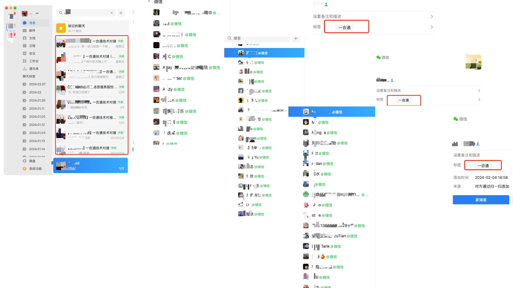


## 给个鼓励

如果觉得还不错，请 Watching，Starred，Fork 吧 ☺
